---
## Front matter
title: "Лабораторная работа №1"
subtitle: "Установка и конфигурация операционной системы на виртуальную машину"
author: "Маслова Анастасия Сергеевна"

## Generic otions
lang: ru-RU
toc-title: "Содержание"

## Bibliography
bibliography: bib/cite.bib
csl: pandoc/csl/gost-r-7-0-5-2008-numeric.csl

## Pdf output format
toc: true # Table of contents
toc-depth: 2
lof: true # List of figures
lot: true # List of tables
fontsize: 12pt
linestretch: 1.5
papersize: a4
documentclass: scrreprt
## I18n polyglossia
polyglossia-lang:
  name: russian
  options:
	- spelling=modern
	- babelshorthands=true
polyglossia-otherlangs:
  name: english
## I18n babel
babel-lang: russian
babel-otherlangs: english
## Fonts
mainfont: PT Serif
romanfont: PT Serif
sansfont: PT Sans
monofont: PT Mono
mainfontoptions: Ligatures=TeX
romanfontoptions: Ligatures=TeX
sansfontoptions: Ligatures=TeX,Scale=MatchLowercase
monofontoptions: Scale=MatchLowercase,Scale=0.9
## Biblatex
biblatex: true
biblio-style: "gost-numeric"
biblatexoptions:
  - parentracker=true
  - backend=biber
  - hyperref=auto
  - language=auto
  - autolang=other*
  - citestyle=gost-numeric
## Pandoc-crossref LaTeX customization
figureTitle: "Рис."
tableTitle: "Таблица"
listingTitle: "Листинг"
lofTitle: "Список иллюстраций"
lotTitle: "Список таблиц"
lolTitle: "Листинги"
## Misc options
indent: true
header-includes:
  - \usepackage{indentfirst}
  - \usepackage{float} # keep figures where there are in the text
  - \floatplacement{figure}{H} # keep figures where there are in the text
---

# Цель работы

Целью данной работы является приобретение практических навыков установки операционной системы на виртуальную машину, настройки минимально необходимых для дальнейшей работы сервисов.

# Выполнение лабораторной работы

Для выполнения лабораторной работы было необходимо установить на виртуальную машину операционную систему Rocky. Сначала я скачала DVD-образ операционной системы с официального сайта, после чего приступила к работе. 

Так как моя версия и внешний вид VirtualBox отличается от описанного в методических материалах (@lab:bash), DVD-образ операционной системы я использовала на самом первом этапе работы, благодаря чему были автоматически выбраны Linux и RedHat (рис. @fig:001):

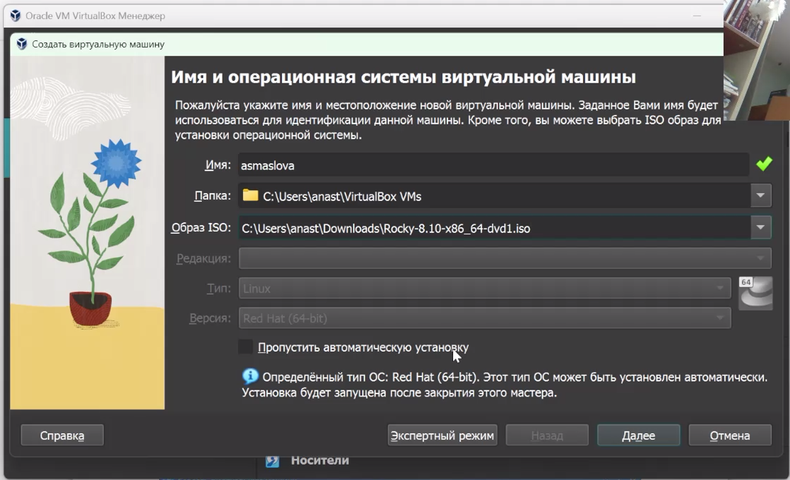{#fig:001 width=70%}

Далее я указала размер основной памяти виртуальной машины — 2048 МБ (рис. @fig:002):

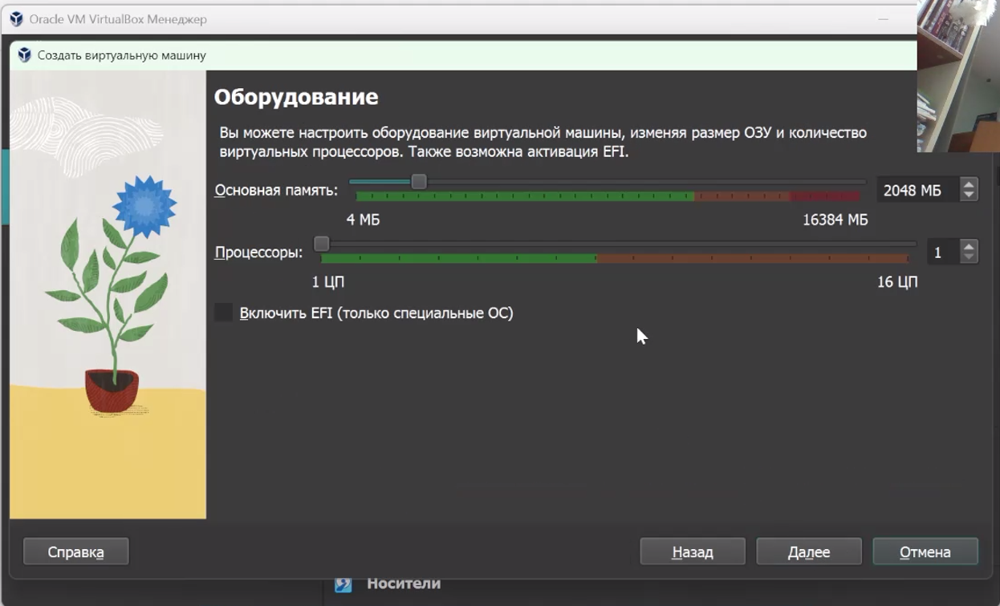{#fig:002 width=70%}

Размер жёсткого диска я задала 40 ГБ (рис. @fig:003).

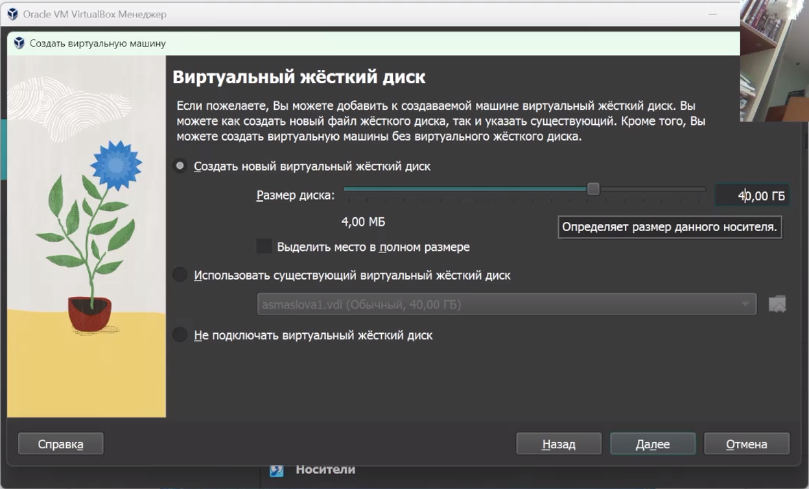{#fig:003 width=70%}

После этого я запустила виртуальную машину и закончила настройки операционной системы, а именно - настройку языка (рис. @fig:004), создание пользователя (рис. @fig:005), отключение KDUMP (рис. @fig:006), в разделе выбора программ указала в качестве базового окружения Server with GUI, а в качестве дополнения — Development Tools (рис. @fig:007), включила сетевое соединение и в качестве имени узла указала asmaslova.localdomain (рис. @fig:008), установила пароль для root и пользователя с правами администратора (рис. @fig:009).

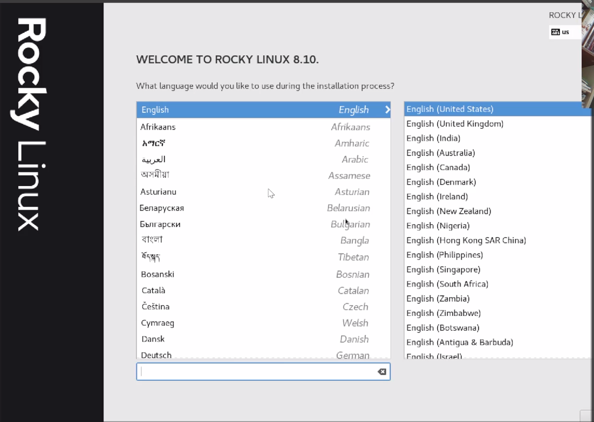{#fig:004 width=70%}

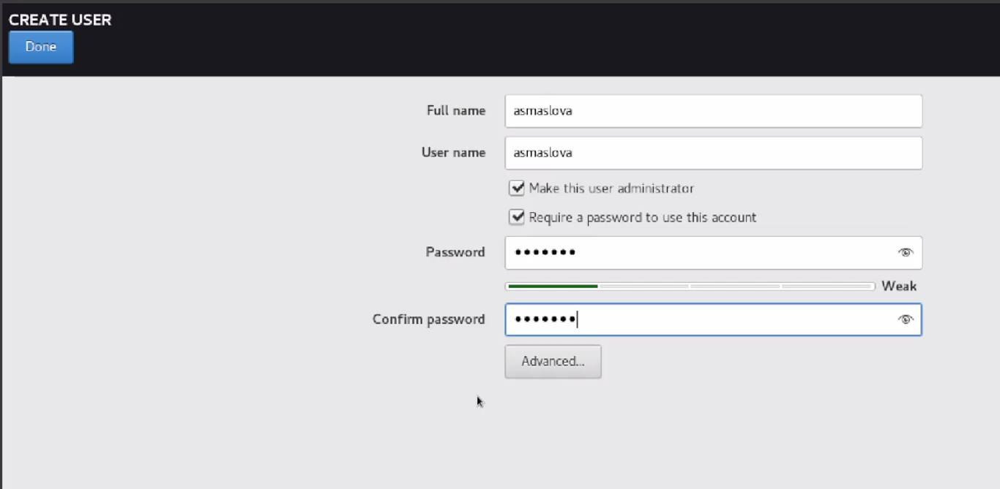{#fig:005 width=70%}

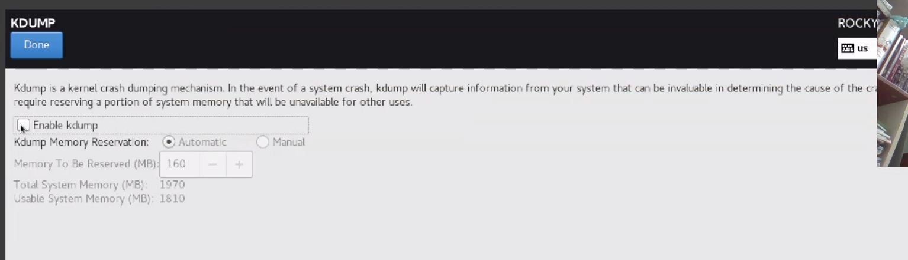{#fig:006 width=70%}

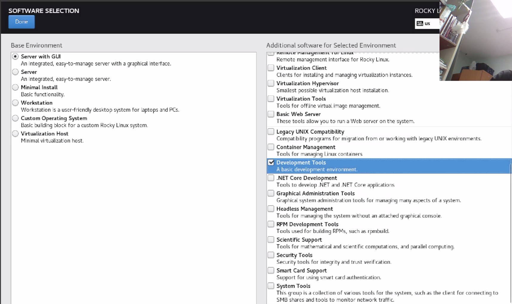{#fig:007 width=70%}

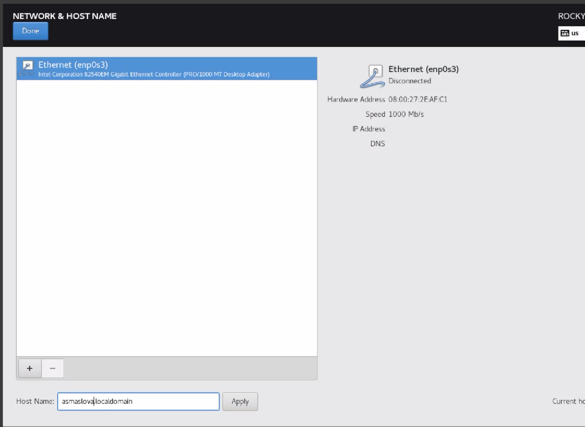{#fig:008 width=70%}

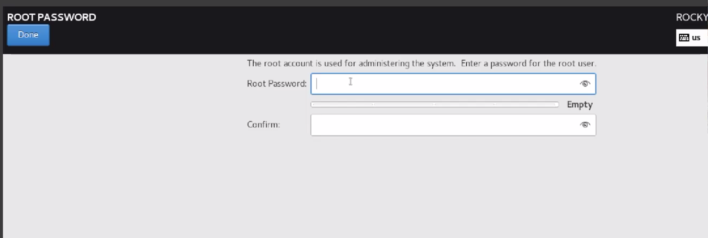{#fig:009 width=70%}

После этого я корректно перезапустила виртуальную машину, приняла условия лицензии. На этом установку операционной системы на виртуальную машину можно считать завершенной.

# Домашняя работа

В качестве домашней работы было необходимо получить следующую информацию:

1. Версия ядра Linux (Linux version).
2. Частота процессора (Detected Mhz processor).
3. Модель процессора (CPU0).
4. Объем доступной оперативной памяти (Memory available).
5. Тип обнаруженного гипервизора (Hypervisor detected).
6. Тип файловой системы корневого раздела.

Все эти данные я получила с помощью следующей команды:

```
dmesg | grep -i "то, что ищем"
```

Я получила следующие результаты (рис. @fig:010 , @fig:010).

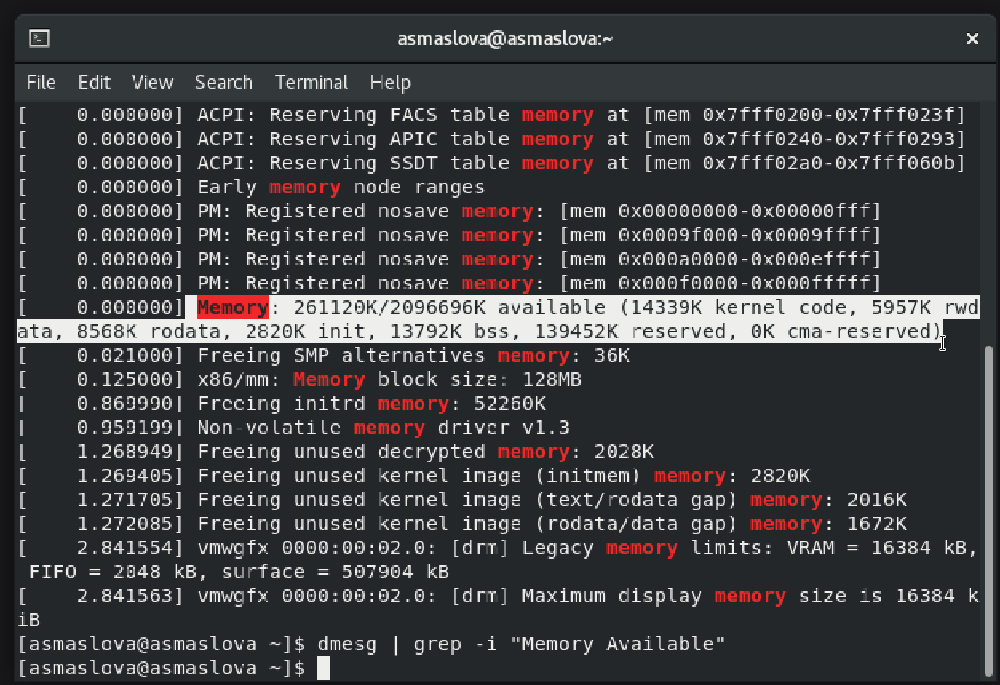{#fig:010 width=70%}

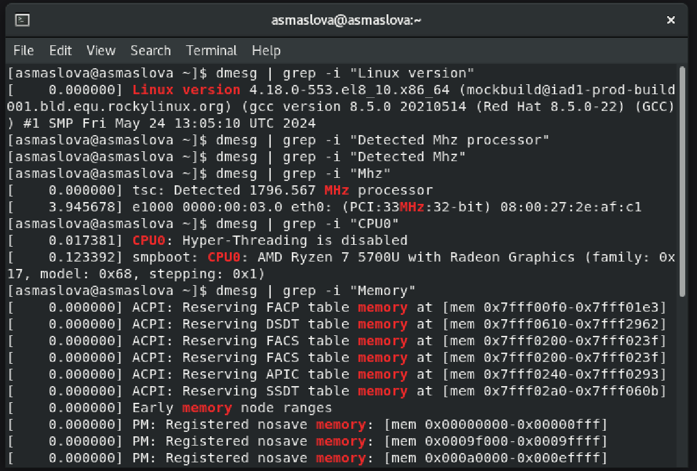{#fig:011 width=70%}

# Выводы

В ходе лабораторной работы я установила на виртуальную машину операционную систему Rocky.

# Список литературы{.unnumbered}

::: {#refs}
:::