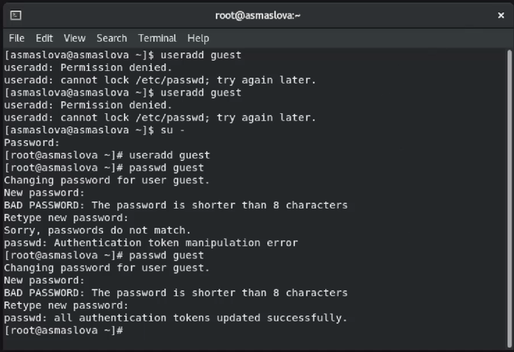
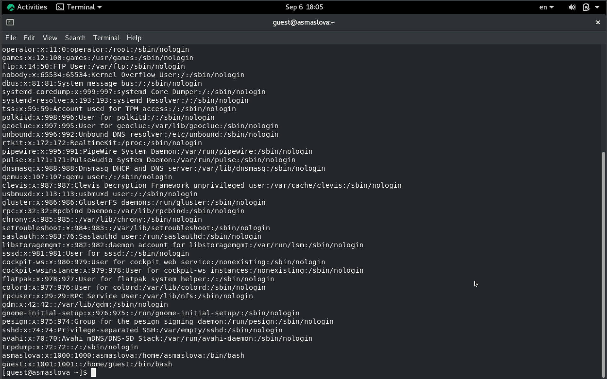
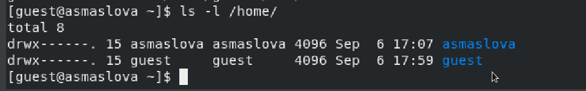
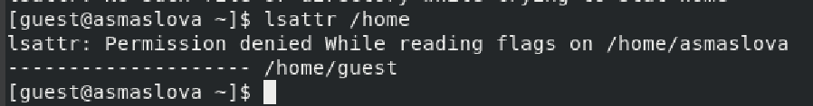
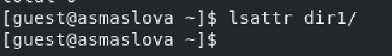
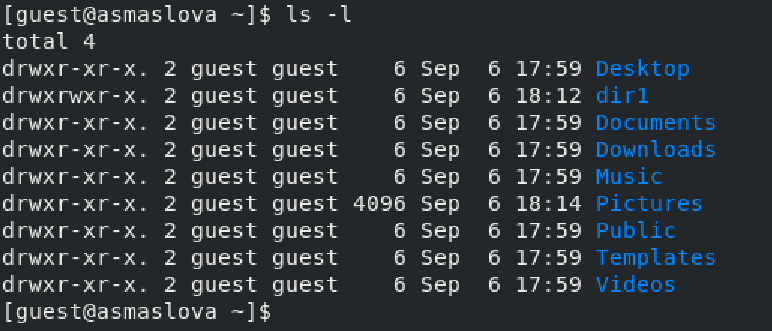
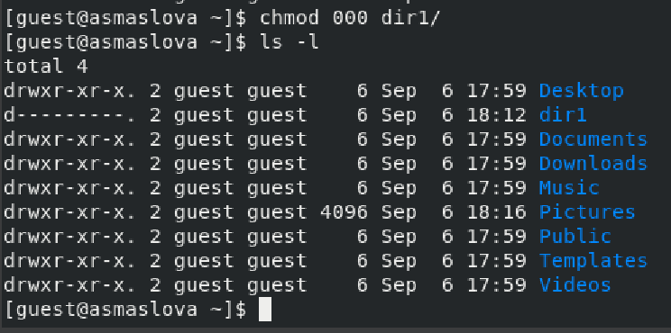
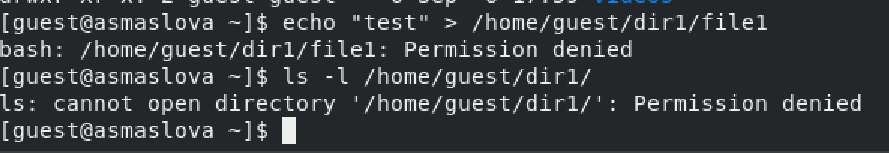

---
## Front matter
lang: ru-RU
title: Лабораторная работа №2
subtitle: "Дискреционное разграничение прав в Linux. Основные атрибуты"
author:
  - Маслова А. С.
institute:
  - Российский университет дружбы народов, Москва, Россия
date: 14 сентября 2024

## i18n babel
babel-lang: russian
babel-otherlangs: english

## Formatting pdf
toc: false
toc-title: Содержание
slide_level: 2
aspectratio: 169
section-titles: true
theme: metropolis
header-includes:
 - \metroset{progressbar=frametitle,sectionpage=progressbar,numbering=fraction}
 - '\makeatletter'
 - '\beamer@ignorenonframefalse'
 - '\makeatother'
---

# Информация

## Докладчик

:::::::::::::: {.columns align=center}
::: {.column width="70%"}

  * Маслова Анастасия Сергеевна
  * студентка группы НКНбд-01-21
  * Российский университет дружбы народов
  * [1032216455@rudn.ru](mailto:1032216455@rudn.ru)
  * <https://github.com/asmaslova/>

:::
::: {.column width="30%"}

:::
::::::::::::::

# Цель работы

## Цель работы

Целью данной работы является получение практических навыков работы в консоли с атрибутами файлов, закрепление теоретических основ дискреционного разграничения доступа в современных системах с открытым кодом на базе ОС Linux.

# Выполнение лабораторной работы

## Выполнение лабораторной работы

Перейдя в учетную запись администратора с помощью команды su - , я создала учетную запись guest, пользуясь командой useradd (рис. [@fig:001]). Я задала пароль для новой учетной записи, используя команду passwd (рис. [@fig:001]). Пароль я установила "1234", потому что у меня очень плохая память. Проблем с входом в учетную запись в тот момент у меня не возникло, поскольку пароль "1234" не успел выветриться из головы, и всё, что мне было нужно - это нажать кнопку "Switch user" и войти в новосозданную учетную запись.

## Выполнение лабораторной работы

{#fig:001 width=70%}

## Выполнение лабораторной работы

По результатам работы команды pwd и сравнением ее с приглашением командной строки я определила, что директория является моей домашней директорией (рис. [@fig:002]). С помощью команды whoami я уточнила имя моего пользователя и подтвердила свои догадки о том, что это, как я и задавала в самом начале, guest (рис. [@fig:002]). Я уточнила имя моего пользователя, его группу, а также группы, куда входит пользователь, командой id. Выведенные значения uid, gid и др. запомнила. Сравнила вывод id с выводом команды groups.

## Выполнение лабораторной работы

Требовалось сравнить полученную информацию об имени пользователя с данными, выводимыми в приглашении командной строки. Эти данные совпадают с данными, выводимыми в приглашении командной строки - и там, и там присутствует guest.

## Выполнение лабораторной работы

Использовав команду cat /etc/passwd ([@fig:003]), я нашла uid и gid пользователя в последней строчке вывода команды. Эти значения совпадают с полученными в предыдущих пунктах.

## Выполнение лабораторной работы

{#fig:003 width=70%}

## Выполнение лабораторной работы

В результате работы команды ls -l /home/ мне удалось получить список поддиректорий директории /home (рис. [@fig:004]). На директориях установлены права drwx, что означает, что только пользователь может читать и писать в эту директорию.

## Выполнение лабораторной работы

{#fig:004 width=70%}

## Выполнение лабораторной работы

При попытке использовать команду lsattr /home я получила отказ, говорящий, что у меня нет разрешения на просмотр расширенных атрибутов директорий (рис. [@fig:006]).

{#fig:006 width=70%}

## Выполнение лабораторной работы

По результатам работы команд lsattr и ls -l (рис. [@fig:007] и рис. [@fig:008]) я узнала, что на директорию dir1 выставлены права drwxrwxr-x, что означает, что доступ к чтению есть у всех, но доступ к записи - только у владельцев.

## Выполнение лабораторной работы

{#fig:007 width=70%}

## Выполнение лабораторной работы

{#fig:008 width=70%}

## Выполнение лабораторной работы

Сняв с директории dir1 все атрибуты командой "chmod 000 dir1" (рис. [@fig:009]), я убедилась в правильности работы команды "ls -l", поскольку теперь атрибут директории выглядел как d---------.

## Выполнение лабораторной работы

{#fig:009 width=70%}

## Выполнение лабораторной работы

Так как ранее мы сняли с директории все атрибуты, у нас нет прав на редактирование, создание или удаление файлов внутри этой директории, поэтому я не смогла создать файл file1 в директории dir1 (рис. [@fig:010]). Более того, я не смогла проверить командой "ls -l /home/guest/dir1", действительно ли файл file1 не находится внутри директории dir1, потому что прав на просмотр файлов директории у меня тоже нет.

## Выполнение лабораторной работы

{#fig:010 width=70%}

## Выполнение лабораторной работы

Для заполнения таблицы я создала 8 директорий с файлами внутри и дала им всем разные атрибуты. Таблица заполнялась на основе данных, представленных в моем отчете.

## Выполнение лабораторной работы

: Установленные права и разрешённые действия {#tbl:2-1}

| Права директории | Права файла | Создание файла | Удаление файла | Запись в файл | Чтение файла | Смена директории | Просмотр файлов в директории | Переименование файла | Смена атрибутов файла |
|------------------|-------------|----------------|----------------|---------------|--------------|------------------|------------------------------|----------------------|-----------------------|
| d----------(000) |    (000)    |       -        |       -        |       -       |      -       |        -         |              -               |          -           |          -            |
| d--x------ (100) |    (100)    |       -        |       -        |       +       |      +       |        +         |              -               |          -           |          +            |
| d-w------- (200) |    (200)    |       -        |       -        |       -       |      -       |        -         |              -               |          -           |          -            |
| d-wx------ (300) |    (300)    |       +        |       +        |       +       |      +       |        +         |              -               |          +           |          +            |
| dr-------- (400) |    (400)    |       -        |       -        |       -       |      -       |        -         |              -               |          -           |          -            |
| dr-x------ (500) |    (500)    |       -        |       -        |       +       |      +       |        +         |              +               |          -           |          +            |
| drw------- (600) |    (600)    |       -        |       -        |       -       |      -       |        -         |              -               |          -           |          -            |
| drwx------ (700) |    (700)    |       +        |       +        |       +       |      +       |        +         |              +               |          +           |          +            |

## Выполнение лабораторной работы

: Минимальные права для совершения действий {#tbl:2-2}

|        Операция        | Минимальные права на директорию | Минимальные права на файл |
|------------------------|---------------------------------|---------------------------|
|     Создание файла     |               300               |            300            |
|     Удаление файла     |               300               |            300            |
|      Чтение файла      |               100               |            100            |
|     Запись в файл      |               100               |            100            |
|  Переименование файла  |               300               |            300            |
| Создание поддиректории |               300               |            300            |
| Удаление поддиректории |               300               |            300            |

# Вывод

## Вывод

В ходе лабораторной работы я получила практические навыки работы в консоли с атрибутами файлов, закрепила теоретические основы дискреционного разграничения доступа в современных системах с открытым кодом на базе ОС Linux.