---
## Front matter
title: "Лабораторная работа №2"
subtitle: "Дискреционное разграничение прав в Linux. Основные атрибуты"
author: "Маслова Анастасия Сергеевна"

## Generic otions
lang: ru-RU
toc-title: "Содержание"

## Bibliography
bibliography: bib/cite.bib
csl: pandoc/csl/gost-r-7-0-5-2008-numeric.csl

## Pdf output format
toc: true # Table of contents
toc-depth: 2
lof: true # List of figures
lot: true # List of tables
fontsize: 12pt
linestretch: 1.5
papersize: a4
documentclass: scrreprt
## I18n polyglossia
polyglossia-lang:
  name: russian
  options:
    - spelling=modern
    - babelshorthands=true
polyglossia-otherlangs:
  name: english
## I18n babel
babel-lang: russian
babel-otherlangs: english
## Fonts
mainfont: PT Serif
romanfont: PT Serif
sansfont: PT Sans
monofont: PT Mono
mainfontoptions: Ligatures=TeX
romanfontoptions: Ligatures=TeX
sansfontoptions: Ligatures=TeX,Scale=MatchLowercase
monofontoptions: Scale=MatchLowercase,Scale=0.9
## Biblatex
biblatex: true
biblio-style: "gost-numeric"
biblatexoptions:
  - parentracker=true
  - backend=biber
  - hyperref=auto
  - language=auto
  - autolang=other*
  - citestyle=gost-numeric
## Pandoc-crossref LaTeX customization
figureTitle: "Рис."
tableTitle: "Таблица"
listingTitle: "Листинг"
lofTitle: "Список иллюстраций"
lotTitle: "Список таблиц"
lolTitle: "Листинги"
## Misc options
indent: true
header-includes:
  - \usepackage{indentfirst}
  - \usepackage{float} # keep figures where there are in the text
  - \floatplacement{figure}{H} # keep figures where there are in the text
---

# Цель работы

Получение практических навыков работы в консоли с атрибутами файлов, закрепление теоретических основ дискреционного разграничения доступа в современных системах с открытым кодом на базе ОС Linux.

# Выполнение лабораторной работы

## 1. В установленной при выполнении предыдущей лабораторной работы операционной системе создайте учётную запись пользователя guest (используя учётную запись администратора)

Перейдя в учетную запись администратора с помощью команды su - , я создала учетную запись guest, пользуясь командой useradd (рис. [@fig:001]).

{#fig:001 width=70%}

## 2. Задайте пароль для пользователя guest (использую учётную запись администратора)

Я задала пароль для новой учетной записи, используя команду passwd (рис. [@fig:001]). Пароль я установила "1234", потому что у меня очень плохая память.

## 3. Войдите в систему от имени пользователя guest.

Проблем с входом в учетную запись в тот момент у меня не возникло, поскольку пароль "1234" не успел выветриться из головы, и всё, что мне было нужно - это нажать кнопку "Switch user" и войти в новосозданную учетную запись.

## 4. Определите директорию, в которой вы находитесь, командой pwd. Сравните её с приглашением командной строки. Определите, является ли она вашей домашней директорией? Если нет, зайдите в домашнюю директорию.

По результатам работы команды pwd и сравнением ее с приглашением командной строки я определила, что директория является моей домашней директорией (рис. [@fig:002]).

{#fig:002 width=70%}

## 5. Уточните имя вашего пользователя командой whoami

С помощью команды whoami я уточнила имя моего пользователя и подтвердила свои догадки о том, что это, как я и задавала в самом начале, guest (рис. [@fig:002]).

## 6. Уточните имя вашего пользователя, его группу, а также группы, куда входит пользователь, командой id. Выведенные значения uid, gid и др. запомните. Сравните вывод id с выводом команды groups.

Весь этот пункт был выполнен двумя командами и получен результат (рис. [@fig:002]).

## 7. Сравните полученную информацию об имени пользователя с данными, выводимыми в приглашении командной строки.

Эти данные совпадают с данными, выводимыми в приглашении командной строки - и там, и там присутствует guest.

## 8. Просмотрите файл /etc/passwd командой "cat /etc/passwd". Найдите в нём свою учётную запись. Определите uid пользователя. Определите gid пользователя. Сравните найденные значения с полученными в предыдущих пунктах.

Использовав команду cat /etc/passwd (рис. [@fig:003] и рис. [@fig:004]), я нашла uid и gid пользователя в последней строчке вывода команды (рис. [@fig:004]). Эти значения совпадают с полученными в предыдущих пунктах.

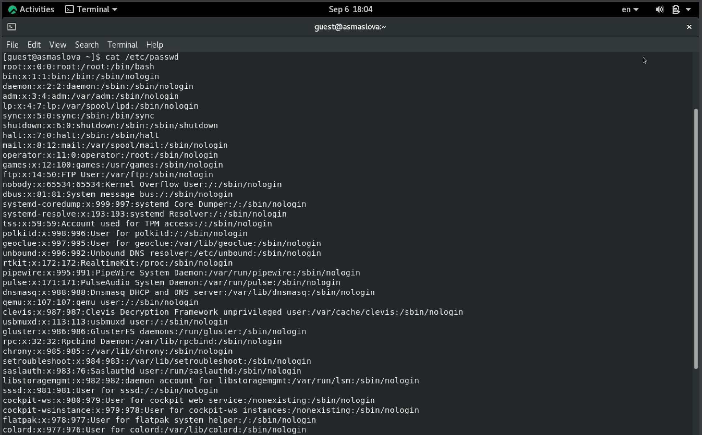{#fig:003 width=70%}

{#fig:004 width=70%}

## 9. Определите существующие в системе директории командой "ls -l /home/" Удалось ли вам получить список поддиректорий директории /home? Какие права установлены на директориях?

В результате работы команды ls -l /home/ мне удалось получить список поддиректорий директории /home (рис. [@fig:005]). На директориях установлены права drwx, что означает, что только пользователь может читать и писать в эту директорию.

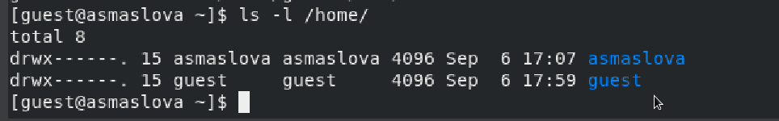{#fig:005 width=70%}

## 10. Проверьте, какие расширенные атрибуты установлены на поддиректориях, находящихся в директории /home, командой "lsattr /home". Удалось ли вам увидеть расширенные атрибуты директории? Удалось ли вам увидеть расширенные атрибуты директорий других пользователей?

При попытке использовать команду lsattr /home я получила отказ, говорящий, что у меня нет разрешения на просмотр расширенных атрибутов директорий (рис. [@fig:006]).

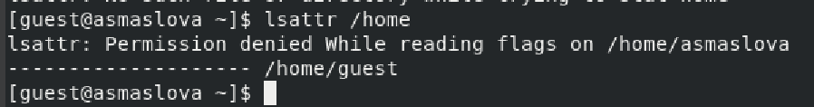{#fig:006 width=70%}

## 11. Создайте в домашней директории поддиректорию dir1 командой "mkdir dir1" Определите командами ls -l и lsattr, какие права доступа и расширенные атрибуты были выставлены на директорию dir1.

По результатам работы команд lsattr и ls -l (рис. [@fig:007] и рис. [@fig:008]) я узнала, что на директорию dir1 выставлены права drwxrwxr-x, что означает, что доступ к чтению есть у всех, но доступ к записи - только у владельцев.

{#fig:007 width=70%}

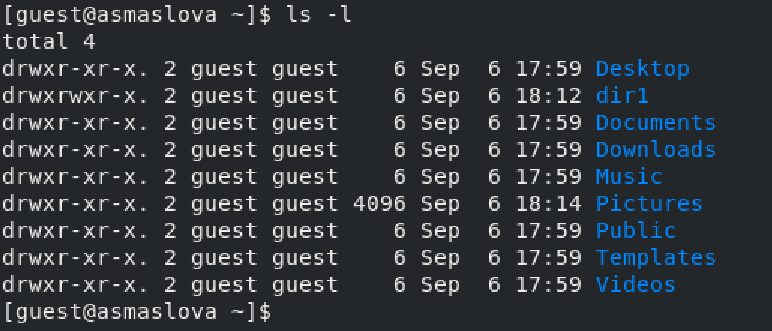{#fig:008 width=70%}

## 12. Снимите с директории dir1 все атрибуты командой "chmod 000 dir1" и проверьте с её помощью правильность выполнения команды "ls -l"

Сняв с директории dir1 все атрибуты командой "chmod 000 dir1" (рис. [@fig:009]), я убедилась в правильности работы команды "ls -l", поскольку теперь атрибут директории выглядел как d---------.

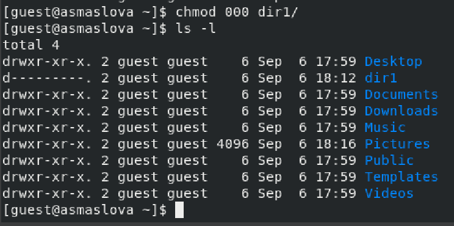{#fig:009 width=70%}

## 13. Попытайтесь создать в директории dir1 файл file1 командой "echo "test" > /home/guest/dir1/file1". Объясните, почему вы получили отказ в выполнении операции по созданию файла? Оцените, как сообщение об ошибке отразилось на создании файла? Проверьте командой "ls -l /home/guest/dir1", действительно ли файл file1 не находится внутри директории dir1.

Так как ранее мы сняли с директории все атрибуты, у нас нет прав на редактирование, создание или удаление файлов внутри этой директории, поэтому я не смогла создать файл file1 в директории dir1 (рис. [@fig:010]). Более того, я не смогла проверить командой "ls -l /home/guest/dir1", действительно ли файл file1 не находится внутри директории dir1, потому что прав на просмотр файлов директории у меня тоже нет.

{#fig:010 width=70%}

## 14. Заполните таблицу «Установленные права и разрешённые действия», выполняя действия от имени владельца директории (файлов), определив опытным путём, какие операции разрешены, а какие нет. Если операция разрешена, занесите в таблицу знак «+», если не разрешена, знак «-».

Для заполнения таблицы я создала 8 директорий с файлами внутри и дала им всем разные атрибуты (рис. [@fig:011], [@fig:012], [@fig:013]).

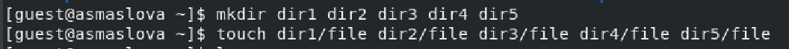{#fig:011 width=70%}

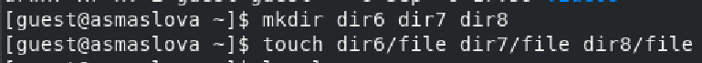{#fig:012 width=70%}

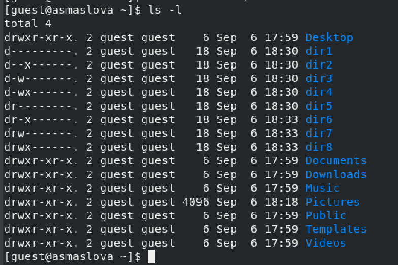{#fig:013 width=70%}

Таблица заполнялась на основе данных, представленных ниже (рис. [@fig:014], [@fig:015], [@fig:016], [@fig:017], [@fig:018], [@fig:019], [@fig:020]).

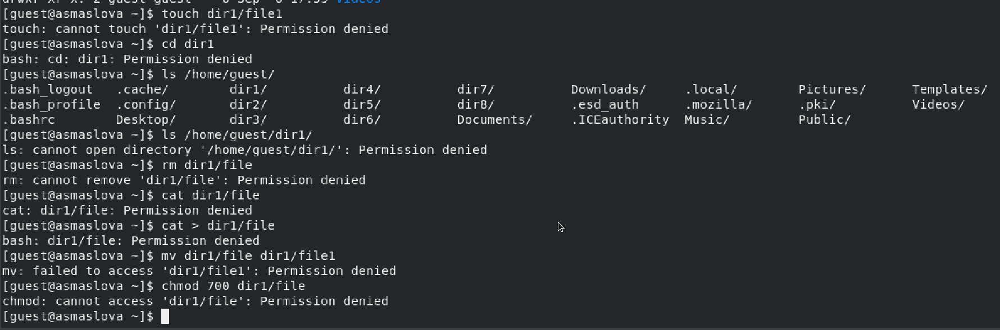{#fig:013 width=70%}

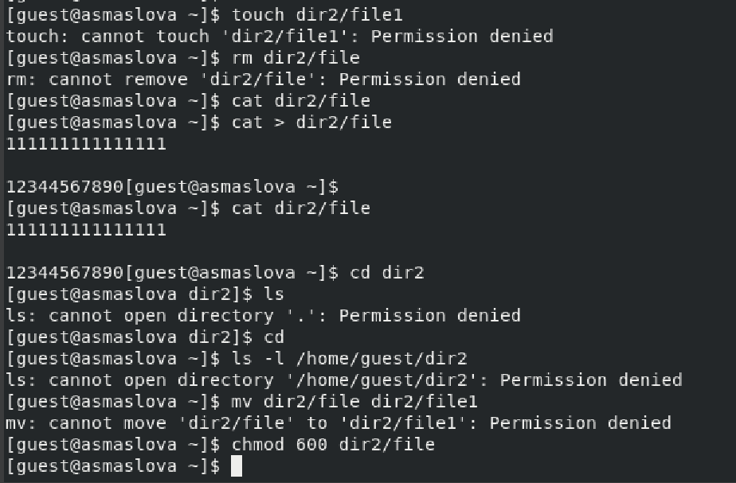{#fig:013 width=70%}

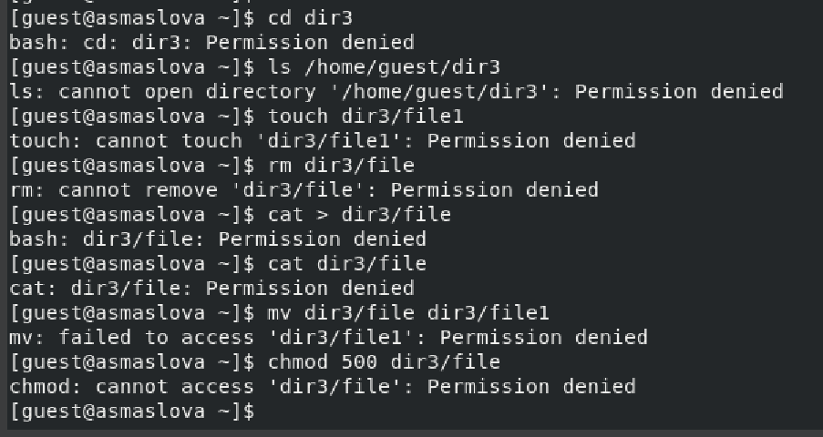{#fig:013 width=70%}

{#fig:013 width=70%}

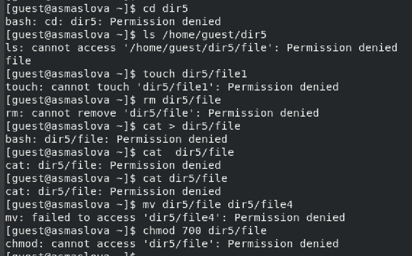{#fig:013 width=70%}

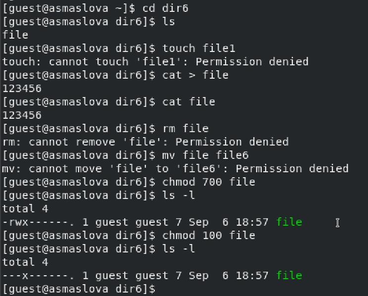{#fig:013 width=70%}

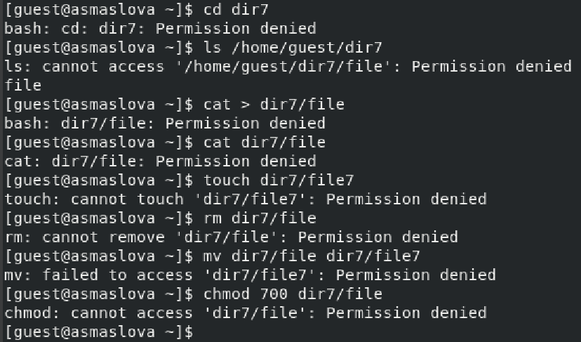{#fig:013 width=70%}

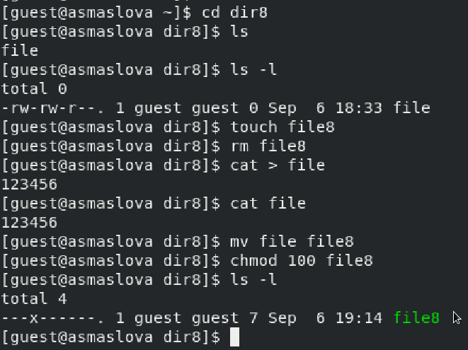{#fig:013 width=70%}

Ниже приведена заполненная таблица (табл. [-@tbl:2-1])

: Установленные права и разрешённые действия {#tbl:2-1}

| Права директории | Права файла | Создание файла | Удаление файла | Запись в файл | Чтение файла | Смена директории | Просмотр файлов в директории | Переименование файла | Смена атрибутов файла |
|------------------|-------------|----------------|----------------|---------------|--------------|------------------|------------------------------|----------------------|-----------------------|
| d----------(000) |    (000)    |       -        |       -        |       -       |      -       |        -         |              -               |          -           |          -            |
| d--x------ (100) |    (100)    |       -        |       -        |       +       |      +       |        +         |              -               |          -           |          +            |
| d-w------- (200) |    (200)    |       -        |       -        |       -       |      -       |        -         |              -               |          -           |          -            |
| d-wx------ (300) |    (300)    |       +        |       +        |       +       |      +       |        +         |              -               |          +           |          +            |
| dr-------- (400) |    (400)    |       -        |       -        |       -       |      -       |        -         |              -               |          -           |          -            |
| dr-x------ (500) |    (500)    |       -        |       -        |       +       |      +       |        +         |              +               |          -           |          +            |
| drw------- (600) |    (600)    |       -        |       -        |       -       |      -       |        -         |              -               |          -           |          -            |
| drwx------ (700) |    (700)    |       +        |       +        |       +       |      +       |        +         |              +               |          +           |          +            |

## 15. На основании заполненной таблицы определите те или иные минимально необходимые права для выполнения операций внутри директории dir1, заполните табл. 2.2.

Ниже приведена заполненная таблица (табл. [-@tbl:2-2])

: Минимальные права для совершения действий {#tbl:2-2}

|        Операция        | Минимальные права на директорию | Минимальные права на файл |
|------------------------|---------------------------------|---------------------------|
|     Создание файла     |               300               |            300            |
|     Удаление файла     |               300               |            300            |
|      Чтение файла      |               100               |            100            |
|     Запись в файл      |               100               |            100            |
|  Переименование файла  |               300               |            300            |
| Создание поддиректории |               300               |            300            |
| Удаление поддиректории |               300               |            300            |

# Выводы

В ходе лабораторной работы я получила практические навыки работы в консоли с атрибутами файлов, закрепила теоретические основы дискреционного разграничения доступа в современных системах с открытым кодом на базе ОС Linux.

# Список литературы{.unnumbered}

::: {#refs}
:::