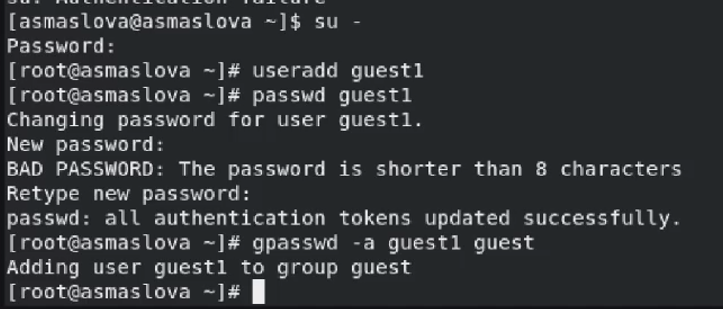
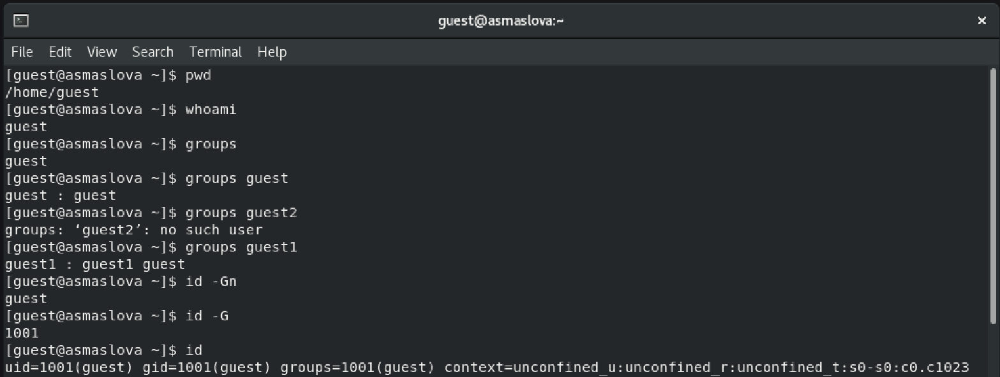
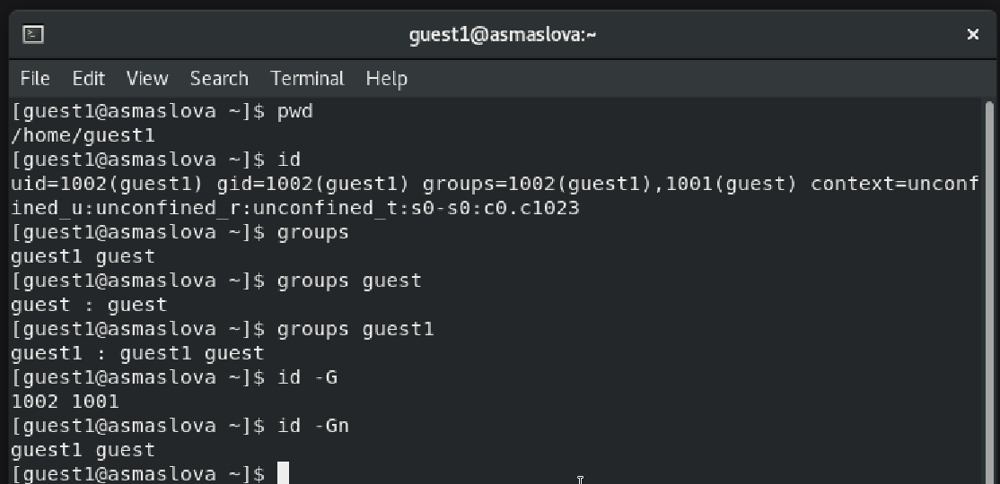
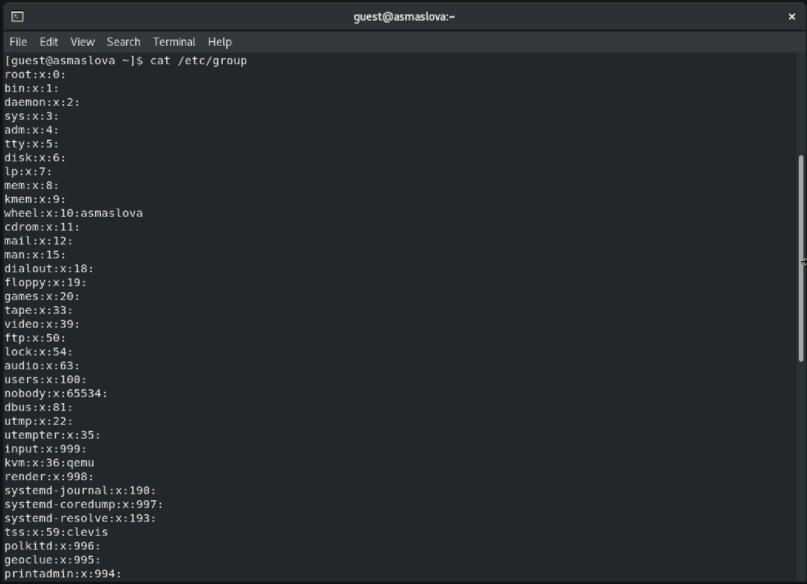
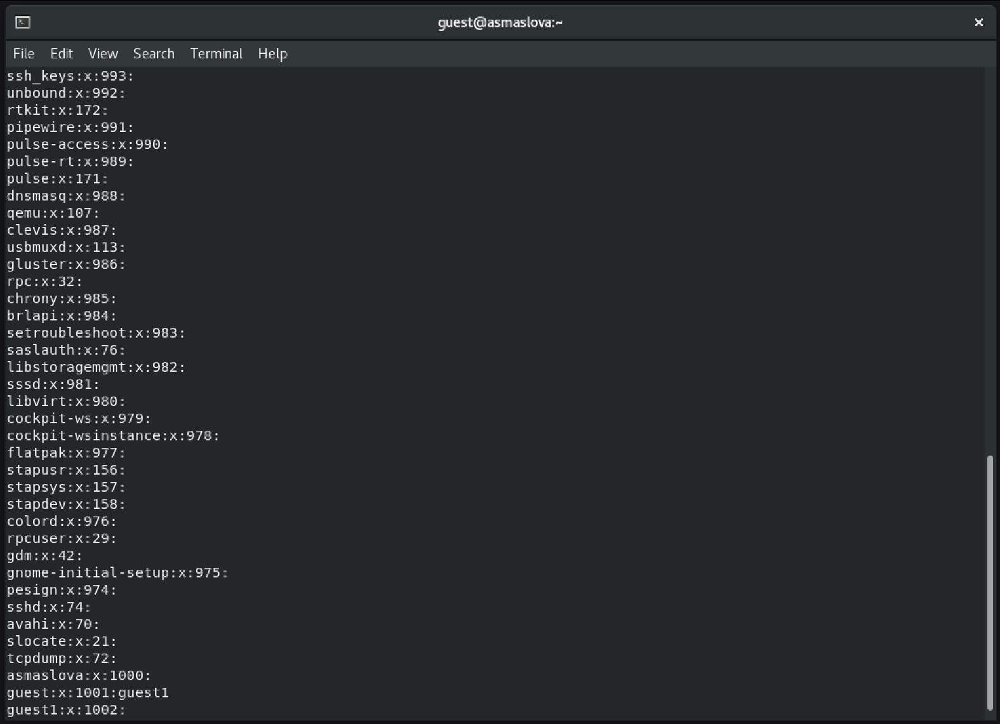
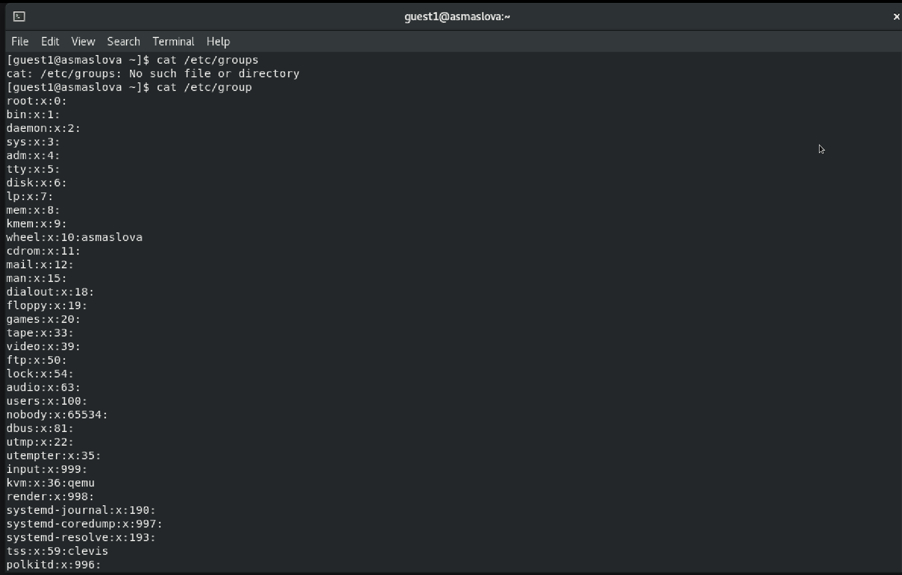
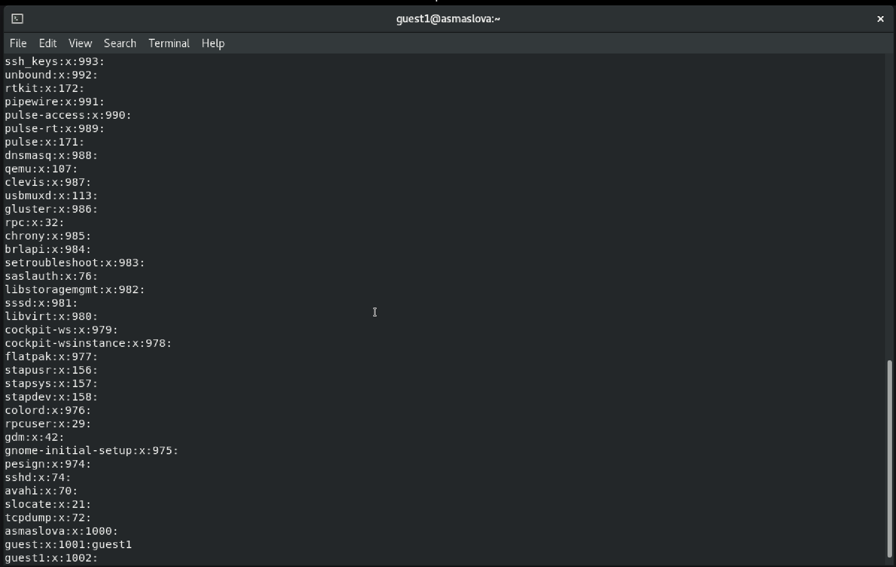
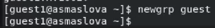
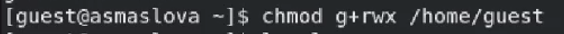

---
## Front matter
lang: ru-RU
title: Лабораторная работа №3
subtitle: "Дискреционное разграничение прав в Linux. Два пользователя"
author:
  - Маслова А. С.
institute:
  - Российский университет дружбы народов, Москва, Россия
date: 20 сентября 2024

## i18n babel
babel-lang: russian
babel-otherlangs: english

## Formatting pdf
toc: false
toc-title: Содержание
slide_level: 2
aspectratio: 169
section-titles: true
theme: metropolis
header-includes:
 - \metroset{progressbar=frametitle,sectionpage=progressbar,numbering=fraction}
 - '\makeatletter'
 - '\beamer@ignorenonframefalse'
 - '\makeatother'
---

# Информация

## Докладчик

:::::::::::::: {.columns align=center}
::: {.column width="70%"}

  * Маслова Анастасия Сергеевна
  * студентка группы НКНбд-01-21
  * Российский университет дружбы народов
  * [1032216455@rudn.ru](mailto:1032216455@rudn.ru)
  * <https://github.com/asmaslova/>

:::
::: {.column width="30%"}

:::
::::::::::::::

# Цель работы

## Цель работы

Получение практических навыков работы в консоли с атрибутами файлов для групп пользователей.

# Выполнение лабораторной работы

## Выполнение лабораторной работы

{#fig:001 width=70%}

## Выполнение лабораторной работы

{#fig:002 width=70%}

## Выполнение лабораторной работы

{#fig:003 width=70%}

## Выполнение лабораторной работы

{#fig:004 width=70%}

## Выполнение лабораторной работы

{#fig:005 width=70%}

## Выполнение лабораторной работы

{#fig:006 width=70%}

## Выполнение лабораторной работы

{#fig:007 width=70%}

## Выполнение лабораторной работы

{#fig:008 width=70%}

## Выполнение лабораторной работы

{#fig:009 width=70%}

## Выполнение лабораторной работы

: Минимальные права для совершения действий {#tbl:3-2}

|        Операция        | Минимальные права на директорию | Минимальные права на файл |
|------------------------|---------------------------------|---------------------------|
| Создание файла | 030 | 030 |
| Удаление файла | 030 | 030 |
| Чтение файла | 010 | 010 |
| Запись в файл | 010 | 010 |
| Переименование файла | 030 | 030 |
| Создание поддиректории | 030 | 030 |
| Удаление поддиректории | 030 | 030 |

# Вывод

## Вывод

В ходе лабораторной работы я получила практические навыки работы в консоли с атрибутами файлов для групп пользователей. 