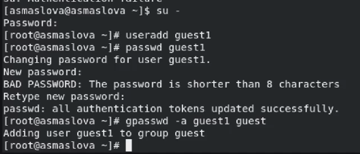
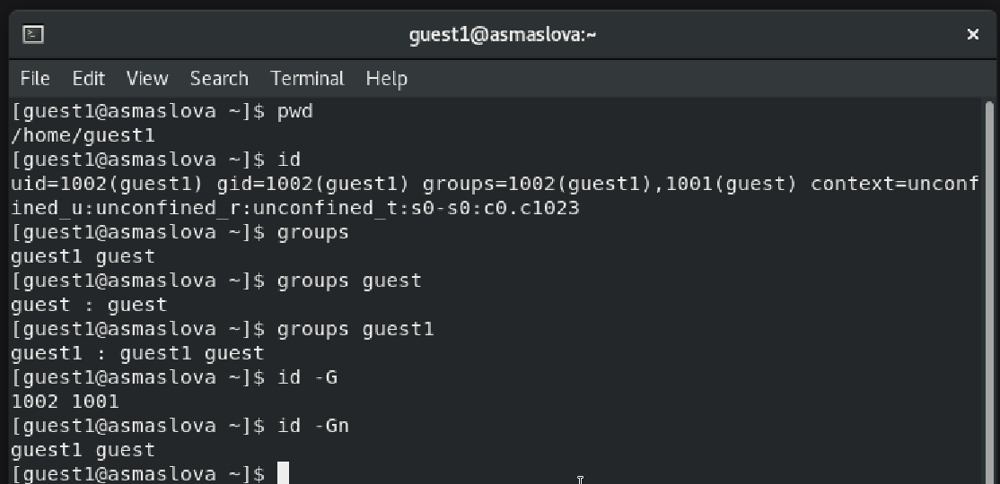

---
## Front matter
title: "Лабораторная работа №3"
subtitle: "Дискреционное разграничение прав в Linux. Два пользователя"
author: "Маслова Анастасия Сергеевна"

## Generic otions
lang: ru-RU
toc-title: "Содержание"

## Bibliography
bibliography: bib/cite.bib
csl: pandoc/csl/gost-r-7-0-5-2008-numeric.csl

## Pdf output format
toc: true # Table of contents
toc-depth: 2
lof: true # List of figures
lot: true # List of tables
fontsize: 12pt
linestretch: 1.5
papersize: a4
documentclass: scrreprt
## I18n polyglossia
polyglossia-lang:
  name: russian
  options:
    - spelling=modern
    - babelshorthands=true
polyglossia-otherlangs:
  name: english
## I18n babel
babel-lang: russian
babel-otherlangs: english
## Fonts
mainfont: PT Serif
romanfont: PT Serif
sansfont: PT Sans
monofont: PT Mono
mainfontoptions: Ligatures=TeX
romanfontoptions: Ligatures=TeX
sansfontoptions: Ligatures=TeX,Scale=MatchLowercase
monofontoptions: Scale=MatchLowercase,Scale=0.9
## Biblatex
biblatex: true
biblio-style: "gost-numeric"
biblatexoptions:
  - parentracker=true
  - backend=biber
  - hyperref=auto
  - language=auto
  - autolang=other*
  - citestyle=gost-numeric
## Pandoc-crossref LaTeX customization
figureTitle: "Рис."
tableTitle: "Таблица"
listingTitle: "Листинг"
lofTitle: "Список иллюстраций"
lotTitle: "Список таблиц"
lolTitle: "Листинги"
## Misc options
indent: true
header-includes:
  - \usepackage{indentfirst}
  - \usepackage{float} # keep figures where there are in the text
  - \floatplacement{figure}{H} # keep figures where there are in the text
---

# Цель работы

Получение практических навыков работы в консоли с атрибутами файлов для групп пользователей.

# Выполнение лабораторной работы

### 

(рис. [@fig:014], [@fig:015], [@fig:016], [@fig:017], [@fig:018], [@fig:019], [@fig:020]).

{#fig:013 width=70%}

{#fig:013 width=70%}

{#fig:013 width=70%}

{#fig:013 width=70%}

{#fig:013 width=70%}

{#fig:013 width=70%}

{#fig:013 width=70%}

{#fig:013 width=70%}

Ниже приведена заполненная таблица (табл. [-@tbl:2-1])

: Установленные права и разрешённые действия {#tbl:2-1}

| Права директории | Права файла | Создание файла | Удаление файла | Запись в файл | Чтение файла | Смена директории | Просмотр файлов в директории | Переименование файла | Смена атрибутов файла |
|------------------|-------------|----------------|----------------|---------------|--------------|------------------|------------------------------|----------------------|-----------------------|
| d---------(000) | (000) | - | - | - | - | - | - | - | - |
| d-----x---(010) | (010) | - | - | + | + | + | - | - | - |
| d----w----(000) | (020) | - | - | - | - | - | - | - | - |
| d----wx---(000) | (030) | + | + | + | + | + | - | + | - |
| d---r-----(000) | (040) | - | - | - | - | - | +/- | - | - |
| d---r-x---(000) | (050) | - | - | + | + | + | + | - | - |
| d---rw----(000) | (060) | - | - | - | - | - | +/- | - | - |
| d---rwx---(000) | (070) | + | + | + | + | + | + | + | - |

## 15. На основании заполненной таблицы определите те или иные минимально необходимые права для выполнения операций внутри директории dir1, заполните табл. 2.2.

Ниже приведена заполненная таблица (табл. [-@tbl:2-2])

: Минимальные права для совершения действий {#tbl:2-2}

|        Операция        | Минимальные права на директорию | Минимальные права на файл |
|------------------------|---------------------------------|---------------------------|
|     Создание файла     |               300               |            300            |
|     Удаление файла     |               300               |            300            |
|      Чтение файла      |               100               |            100            |
|     Запись в файл      |               100               |            100            |
|  Переименование файла  |               300               |            300            |
| Создание поддиректории |               300               |            300            |
| Удаление поддиректории |               300               |            300            |

# Выводы

В ходе лабораторной работы я получила практические навыки работы в консоли с атрибутами файлов, закрепила теоретические основы дискреционного разграничения доступа в современных системах с открытым кодом на базе ОС Linux.

# Список литературы{.unnumbered}

::: {#refs}
:::