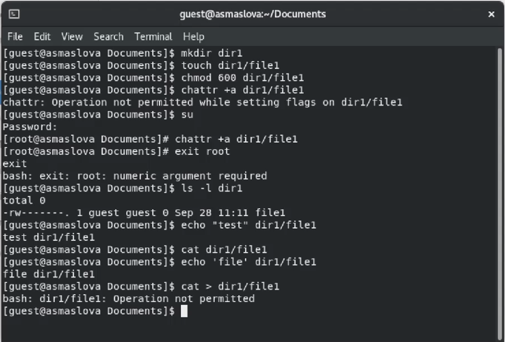
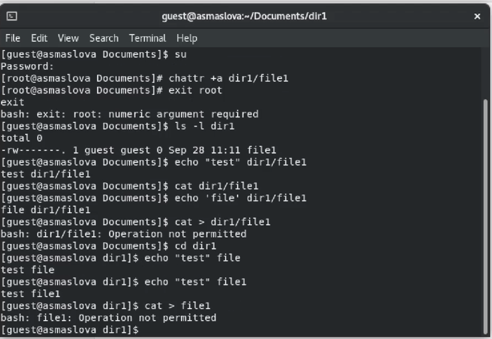

---
## Front matter
title: "Лабораторная работа №4"
subtitle: " Дискреционное разграничение прав в Linux. Расширенные атрибуты"
author: "Маслова Анастасия Сергеевна"

## Generic otions
lang: ru-RU
toc-title: "Содержание"

## Bibliography
bibliography: bib/cite.bib
csl: pandoc/csl/gost-r-7-0-5-2008-numeric.csl

## Pdf output format
toc: true # Table of contents
toc-depth: 2
lof: true # List of figures
lot: true # List of tables
fontsize: 12pt
linestretch: 1.5
papersize: a4
documentclass: scrreprt
## I18n polyglossia
polyglossia-lang:
  name: russian
  options:
    - spelling=modern
    - babelshorthands=true
polyglossia-otherlangs:
  name: english
## I18n babel
babel-lang: russian
babel-otherlangs: english
## Fonts
mainfont: PT Serif
romanfont: PT Serif
sansfont: PT Sans
monofont: PT Mono
mainfontoptions: Ligatures=TeX
romanfontoptions: Ligatures=TeX
sansfontoptions: Ligatures=TeX,Scale=MatchLowercase
monofontoptions: Scale=MatchLowercase,Scale=0.9
## Biblatex
biblatex: true
biblio-style: "gost-numeric"
biblatexoptions:
  - parentracker=true
  - backend=biber
  - hyperref=auto
  - language=auto
  - autolang=other*
  - citestyle=gost-numeric
## Pandoc-crossref LaTeX customization
figureTitle: "Рис."
tableTitle: "Таблица"
listingTitle: "Листинг"
lofTitle: "Список иллюстраций"
lotTitle: "Список таблиц"
lolTitle: "Листинги"
## Misc options
indent: true
header-includes:
  - \usepackage{indentfirst}
  - \usepackage{float} # keep figures where there are in the text
  - \floatplacement{figure}{H} # keep figures where there are in the text
---

# Цель работы

Получение практических навыков работы в консоли с расширенными атрибутами файлов.

# Выполнение лабораторной работы

1. От имени пользователя guest определите расширенные атрибуты файла /home/guest/dir1/file1 командой `lsattr /home/guest/dir1/file1`

2. Установите командой `chmod 600 file1` на файл file1 права, разрешающие чтение и запись для владельца файла.

3. Попробуйте установить на файл /home/guest/dir1/file1 расширенный атрибут a от имени пользователя guest: `chattr +a /home/guest/dir1/file1`

4. Зайдите на третью консоль с правами администратора либо повысьте свои права с помощью команды su. Попробуйте установить расширенный атрибут a на файл /home/guest/dir1/file1 от имени суперпользователя: `chattr +a /home/guest/dir1/file1`

Выполнение пунктов 1, 2, 3 и 4 можно видеть на рисунке ниже (рис. [@fig:001]). Единственным отличие является то, что второй гостевой профиль я назвала guest1.

{#fig:001 width=70%}

5. Осуществите вход в систему от двух пользователей на двух разных консолях: guest на первой консоли и guest2 на второй консоли.

Я не знаю, как это сделать, и internet research тоже не дал никаких результатов, поэтому я пропустила этот пункт, решив просто переключаться между профилями.

6. Для обоих пользователей командой pwd определите директорию, в которой вы находитесь. Сравните её с приглашениями командной строки.

7. Уточните имя вашего пользователя, его группу, кто входит в неё и к каким группам принадлежит он сам. Определите командами groups guest и groups guest2, в какие группы входят пользователи guest и guest2. Сравните вывод команды groups с выводом команд id -Gn и id -G.

Я выполнила пункты 6 и 7 сначала для пользователя guest (рис. [@fig:002]), а затем для пользователя guest1 (рис. [@fig:003]).

{#fig:002 width=70%}

{#fig:003 width=70%}

8. Сравните полученную информацию с содержимым файла /etc/group. Просмотрите файл командой cat /etc/group

Я сравнила полученные данные с содержимым файла /etc/group у пользователя guest (рис. [@fig:004], рис. [@fig:005]) и guest1 (рис. [@fig:006], рис. [@fig:007]).

{#fig:004 width=70%}

{#fig:005 width=70%}

{#fig:006 width=70%}

{#fig:007 width=70%}

9. От имени пользователя guest2 выполните регистрацию пользователя guest2 в группе guest командой newgrp guest

Выполнение пункта 9 представлено на рисунке ниже (рис. [@fig:008]).

{#fig:008 width=70%}

10. От имени пользователя guest измените права директории /home/guest, разрешив все действия для пользователей группы: chmod g+rwx /home/guest

Выполнение пункта 10 представлено на рисунке ниже (рис. [@fig:009]).

{#fig:009 width=70%}

11. От имени пользователя guest снимите с директории /home/guest/dir1 все атрибуты командой chmod 000 dirl и проверьте правильность снятия атрибутов.

12. Меняя атрибуты у директории dir1 и файла file1 от имени пользователя guest и делая проверку от пользователя guest2, заполните табл. 3.1, определив опытным путём, какие операции разрешены, а какие нет. Если операция разрешена, занесите в таблицу знак «+», если не разрешена, знак «-». Сравните табл. 2.1 (из лабораторной работы № 2) и табл. 3.1. На основании заполненной таблицы определите те или иные минимально необходимые права для выполнения пользователем guest2 операций внутри директории dir1 и заполните табл. 3.2.

Для удобства выполнения задания я создала 8 директорий, каждая из которых получила свои права доступа (рис. [@fig:010], [@fig:011]).

{#fig:010 width=70%}

{#fig:011 width=70%}

Пункты 11 и 12 были выполнены на основе данных ниже (рис. [@fig:012], [@fig:013], [@fig:014], [@fig:015], [@fig:016], [@fig:017], [@fig:018], [@fig:019]).

{#fig:012 width=70%}

{#fig:013 width=70%}

{#fig:014 width=70%}

{#fig:015 width=70%}

{#fig:016 width=70%}

{#fig:017 width=70%}

{#fig:018 width=70%}

{#fig:019 width=70%}

Ниже приведена заполненная таблица (табл. [-@tbl:3-1])

: Установленные права и разрешённые действия {#tbl:3-1}

| Права директории | Права файла | Создание файла | Удаление файла | Запись в файл | Чтение файла | Смена директории | Просмотр файлов в директории | Переименование файла | Смена атрибутов файла |
|------------------|-------------|----------------|----------------|---------------|--------------|------------------|------------------------------|----------------------|-----------------------|
| d---------(000) | (000) | - | - | - | - | - | - | - | - |
| d-----x---(010) | (010) | - | - | + | + | + | - | - | - |
| d----w----(000) | (020) | - | - | - | - | - | - | - | - |
| d----wx---(000) | (030) | + | + | + | + | + | - | + | - |
| d---r-----(000) | (040) | - | - | - | - | - | +/- | - | - |
| d---r-x---(000) | (050) | - | - | + | + | + | + | - | - |
| d---rw----(000) | (060) | - | - | - | - | - | +/- | - | - |
| d---rwx---(000) | (070) | + | + | + | + | + | + | + | - |

## 15. На основании заполненной таблицы определите те или иные минимально необходимые права для выполнения операций внутри директории dir1, заполните табл. 2.2.

Ниже приведена заполненная таблица (табл. [-@tbl:3-2])

: Минимальные права для совершения действий {#tbl:3-2}

|        Операция        | Минимальные права на директорию | Минимальные права на файл |
|------------------------|---------------------------------|---------------------------|
| Создание файла | 030 | 030 |
| Удаление файла | 030 | 030 |
| Чтение файла | 010 | 010 |
| Запись в файл | 010 | 010 |
| Переименование файла | 030 | 030 |
| Создание поддиректории | 030 | 030 |
| Удаление поддиректории | 030 | 030 |

# Выводы

В ходе лабораторной работы я получила практические навыки работы в консоли с атрибутами файлов для групп пользователей.

# Список литературы{.unnumbered}

::: {#refs}
:::