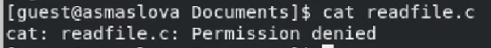

---
## Front matter
title: "Лабораторная работа №5"
subtitle: "Дискреционное разграничение прав в Linux. Исследование влияния дополнительных атрибутов"
author: "Маслова Анастасия Сергеевна"

## Generic otions
lang: ru-RU
toc-title: "Содержание"

## Bibliography
bibliography: bib/cite.bib
csl: pandoc/csl/gost-r-7-0-5-2008-numeric.csl

## Pdf output format
toc: true # Table of contents
toc-depth: 2
lof: true # List of figures
lot: true # List of tables
fontsize: 12pt
linestretch: 1.5
papersize: a4
documentclass: scrreprt
## I18n polyglossia
polyglossia-lang:
  name: russian
  options:
    - spelling=modern
    - babelshorthands=true
polyglossia-otherlangs:
  name: english
## I18n babel
babel-lang: russian
babel-otherlangs: english
## Fonts
mainfont: PT Serif
romanfont: PT Serif
sansfont: PT Sans
monofont: PT Mono
mainfontoptions: Ligatures=TeX
romanfontoptions: Ligatures=TeX
sansfontoptions: Ligatures=TeX,Scale=MatchLowercase
monofontoptions: Scale=MatchLowercase,Scale=0.9
## Biblatex
biblatex: true
biblio-style: "gost-numeric"
biblatexoptions:
  - parentracker=true
  - backend=biber
  - hyperref=auto
  - language=auto
  - autolang=other*
  - citestyle=gost-numeric
## Pandoc-crossref LaTeX customization
figureTitle: "Рис."
tableTitle: "Таблица"
listingTitle: "Листинг"
lofTitle: "Список иллюстраций"
lotTitle: "Список таблиц"
lolTitle: "Листинги"
## Misc options
indent: true
header-includes:
  - \usepackage{indentfirst}
  - \usepackage{float} # keep figures where there are in the text
  - \floatplacement{figure}{H} # keep figures where there are in the text
---

# Цель работы

Изучение механизмов изменения идентификаторов, применения SetUID- и Sticky-битов. Получение практических навыков работы в консоли с дополнительными атрибутами. Рассмотрение работы механизма смены идентификатора процессов пользователей, а также влияние бита Sticky на запись и удаление файлов.

# Выполнение лабораторной работы

1. Войдите в систему от имени пользователя guest.
2. Создайте программу simpleid.c:
```c++
#include <sys/types.h>
#include <unistd.h>
#include <stdio.h>
int
main ()
{
uid_t uid = geteuid ();
gid_t gid = getegid ();
printf ("uid=%d, gid=%d\n", uid, gid);
return 0;
}
```
Выполнение этих двух пунктов вы можете видеть ниже (рис. [@fig:001]).

{#fig:001 width=70%}

3. Скомплилируйте программу и убедитесь, что файл программы создан:
`gcc simpleid.c -o simpleid`
4. Выполните программу simpleid:
`./simpleid`
5. Выполните системную программу id:
`id`
и сравните полученный вами результат с данными предыдущего пункта задания.
6. Усложните программу, добавив вывод действительных идентификаторов:
```c++
#include <sys/types.h>
#include <unistd.h>
#include <stdio.h>
int
main ()
{
    uid_t real_uid = getuid ();
    uid_t e_uid = geteuid ();
    gid_t real_gid = getgid ();
    gid_t e_gid = getegid () ;
    printf ("e_uid=%d, e_gid=%d\n", e_uid, e_gid);
    printf ("real_uid=%d, real_gid=%d\n", real_uid, real_gid);
    return 0;
}
```
Получившуюся программу назовите simpleid2.c.

7. Скомпилируйте и запустите simpleid2.c:
```bash
gcc simpleid2.c -o simpleid2
./simpleid2
```
8. От имени суперпользователя выполните команды:
```bash
chown root:guest /home/guest/simpleid2
chmod u+s /home/guest/simpleid2
```

# Выводы

В ходе лабораторной работы я получила практические навыки работы в консоли с атрибутами файлов для групп пользователей.

# Список литературы{.unnumbered}

::: {#refs}
:::