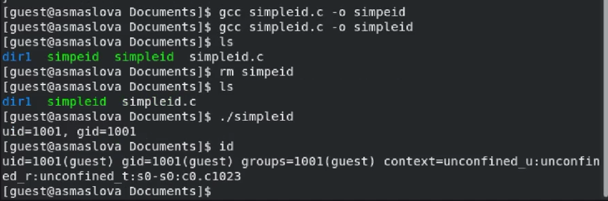
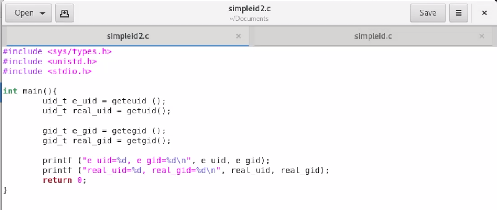
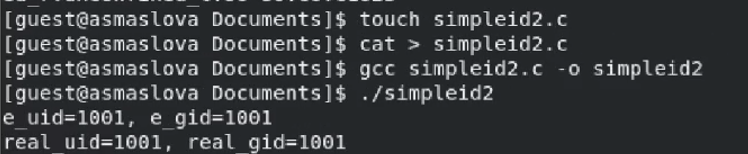
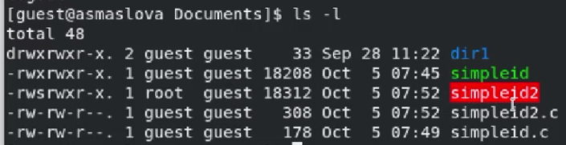
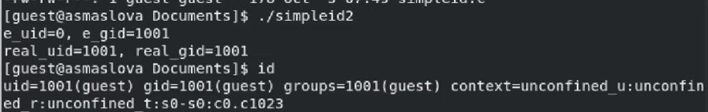

---
## Front matter
title: "Лабораторная работа №5"
subtitle: "Дискреционное разграничение прав в Linux. Исследование влияния дополнительных атрибутов"
author: "Маслова Анастасия Сергеевна"

## Generic otions
lang: ru-RU
toc-title: "Содержание"

## Bibliography
bibliography: bib/cite.bib
csl: pandoc/csl/gost-r-7-0-5-2008-numeric.csl

## Pdf output format
toc: true # Table of contents
toc-depth: 2
lof: true # List of figures
lot: true # List of tables
fontsize: 12pt
linestretch: 1.5
papersize: a4
documentclass: scrreprt
## I18n polyglossia
polyglossia-lang:
  name: russian
  options:
    - spelling=modern
    - babelshorthands=true
polyglossia-otherlangs:
  name: english
## I18n babel
babel-lang: russian
babel-otherlangs: english
## Fonts
mainfont: PT Serif
romanfont: PT Serif
sansfont: PT Sans
monofont: PT Mono
mainfontoptions: Ligatures=TeX
romanfontoptions: Ligatures=TeX
sansfontoptions: Ligatures=TeX,Scale=MatchLowercase
monofontoptions: Scale=MatchLowercase,Scale=0.9
## Biblatex
biblatex: true
biblio-style: "gost-numeric"
biblatexoptions:
  - parentracker=true
  - backend=biber
  - hyperref=auto
  - language=auto
  - autolang=other*
  - citestyle=gost-numeric
## Pandoc-crossref LaTeX customization
figureTitle: "Рис."
tableTitle: "Таблица"
listingTitle: "Листинг"
lofTitle: "Список иллюстраций"
lotTitle: "Список таблиц"
lolTitle: "Листинги"
## Misc options
indent: true
header-includes:
  - \usepackage{indentfirst}
  - \usepackage{float} # keep figures where there are in the text
  - \floatplacement{figure}{H} # keep figures where there are in the text
---

# Цель работы

Изучение механизмов изменения идентификаторов, применения SetUID- и Sticky-битов. Получение практических навыков работы в консоли с дополнительными атрибутами. Рассмотрение работы механизма смены идентификатора процессов пользователей, а также влияние бита Sticky на запись и удаление файлов.

# Выполнение лабораторной работы

## Создание программы

1. Войдите в систему от имени пользователя guest.
2. Создайте программу simpleid.c:
```c
#include <sys/types.h>
#include <unistd.h>
#include <stdio.h>
int
main ()
{
uid_t uid = geteuid ();
gid_t gid = getegid ();
printf ("uid=%d, gid=%d\n", uid, gid);
return 0;
}
```
Выполнение этих двух пунктов вы можете видеть ниже (рис. [@fig:001]).

{#fig:001 width=70%}

3. Скомплилируйте программу и убедитесь, что файл программы создан:
`gcc simpleid.c -o simpleid`
4. Выполните программу simpleid:
`./simpleid`
5. Выполните системную программу id:
`id`
и сравните полученный вами результат с данными предыдущего пункта задания.

Выполнение этих трех пунктов вы можете видеть ниже (рис. [@fig:002]).

{#fig:002 width=70%}

6. Усложните программу, добавив вывод действительных идентификаторов:
```c
#include <sys/types.h>
#include <unistd.h>
#include <stdio.h>
int
main ()
{
    uid_t real_uid = getuid ();
    uid_t e_uid = geteuid ();
    gid_t real_gid = getgid ();
    gid_t e_gid = getegid () ;
    printf ("e_uid=%d, e_gid=%d\n", e_uid, e_gid); 
    printf ("real_uid=%d, real_gid=%d\n", real_uid, real_gid);
    return 0;
}
```
Получившуюся программу назовите simpleid2.c.

Я создала файл simpleid2.c и записала туда этот код (рис. [@fig:003]).

{#fig:003 width=70%}

7. Скомпилируйте и запустите simpleid2.c:
```bash
gcc simpleid2.c -o simpleid2
./simpleid2
```
Я скомпилировала и запустила названный файл (рис. [@fig:004]).

{#fig:004 width=70%}

8. От имени суперпользователя выполните команды:
```bash
chown root:guest /home/guest/simpleid2
chmod u+s /home/guest/simpleid2
```
9. Используйте sudo или повысьте временно свои права с помощью su. Поясните, что делают эти команды.

Повысив свои права с помощью команды `su -`, я от имени суперпользователя выполнила указанные команды для изменения прав на файл simpleid2 (рис. [@fig:005]).

{#fig:005 width=70%}

10. Выполните проверку правильности установки новых атрибутов и смены владельца файла simpleid2:
```bash
ls -l simpleid2
```

Выполнение этого пункта вы можете видеть ниже (рис. [@fig:006]).

{#fig:002 width=70%}

11. Запустите simpleid2 и id:
```bash
./simpleid2
id
```
Сравните результаты.

Выполнение этого пункта вы можете видеть ниже (рис. [@fig:007]).

{#fig:002 width=70%}


12. Проделайте тоже самое относительно SetGID-бита.
13. Создайте программу readfile.c:
```c
#include <fcntl.h>
#include <stdio.h>
#include <sys/stat.h>
#include <sys/types.h>
#include <unistd.h>
int
main (int argc, char* argv[])
{
  unsigned char buffer[16];
  size_t bytes_read;
  int i;
  int fd = open (argv[1], O_RDONLY);
  do
  {
    bytes_read = read (fd, buffer, sizeof (buffer));
    for (i =0; i < bytes_read; ++i) printf("%c", buffer[i]);
  }
  while (bytes_read == sizeof (buffer));
  close (fd);
  return 0;
}
```
14. Откомпилируйте её.
```bash
gcc readfile.c -o readfile
```
15. Смените владельца у файла readfile.c (или любого другого текстового файла в системе) и измените права так, чтобы только суперпользователь (root) мог прочитать его, a guest не мог.
16. Проверьте, что пользователь guest не может прочитать файл readfile.c.
17. Смените у программы readfile владельца и установите SetU’D-бит.
18. Проверьте, может ли программа readfile прочитать файл readfile.c?
19. Проверьте, может ли программа readfile прочитать файл /etc/shadow? Отразите полученный результат и ваши объяснения в отчёте.

## Исследование Sticky-бита

1. Выясните, установлен ли атрибут Sticky на директории /tmp, для чего выполните команду
```bash
ls -l / | grep tmp
```
2. От имени пользователя guest создайте файл file01.txt в директории /tmp со словом test:
```bash
echo "test" > /tmp/file01.txt
```
3. Просмотрите атрибуты у только что созданного файла и разрешите чтение и запись для категории пользователей «все остальные»:
```bash
ls -l /tmp/file01.txt
chmod o+rw /tmp/file01.txt
ls -l /tmp/file01.txt
```
4. От пользователя guest2 (не являющегося владельцем) попробуйте прочитать файл /tmp/file01.txt:
`cat /tmp/file01.txt`
5. От пользователя guest2 попробуйте дозаписать в файл /tmp/file01.txt слово test2 командой `echo "test2" > /tmp/file01.txt`. Удалось ли вам выполнить операцию?
6. Проверьте содержимое файла командой `cat /tmp/file01.txt`
7. От пользователя guest2 попробуйте записать в файл /tmp/file01.txt слово test3, стерев при этом всю имеющуюся в файле информацию командой `echo "test3" > /tmp/file01.txt`. Удалось ли вам выполнить операцию?
8. Проверьте содержимое файла командой `cat /tmp/file01.txt`
9. От пользователя guest2 попробуйте удалить файл /tmp/file01.txt командой `rm /tmp/fileOl.txt`. Удалось ли вам удалить файл?
10. Повысьте свои права до суперпользователя следующей командой `su -` и выполните после этого команду, снимающую атрибут t (Sticky-бит) с
директории /tmp: `chmod -t /tmp`
11. Покиньте режим суперпользователя командой `exit`
12. От пользователя guest2 проверьте, что атрибута t у директории /tmp нет:
`ls -l / | grep tmp`
13. Повторите предыдущие шаги. Какие наблюдаются изменения?
14. Удалось ли вам удалить файл от имени пользователя, не являющегося его владельцем? Ваши наблюдения занесите в отчёт.
15. Повысьте свои права до суперпользователя и верните атрибут t на директорию /tmp:
```bash
su -
chmod +t /tmp
exit
```

# Выводы

В ходе лабораторной работы я изучила механизмы изменения идентификаторов, применения SetUID- и Sticky-битов, получила практические навыки работы в консоли с дополнительными атрибутами, рассмотрела работу механизма смены идентификатора процессов пользователей, а также влияние бита Sticky на запись и удаление файлов.

# Список литературы{.unnumbered}

::: {#refs}
:::