---
## Front matter
title: "Лабораторная работа №6"
subtitle: "Мандатное разграничение прав в Linux"
author: "Маслова Анастасия Сергеевна"

## Generic otions
lang: ru-RU
toc-title: "Содержание"

## Bibliography
bibliography: bib/cite.bib
csl: pandoc/csl/gost-r-7-0-5-2008-numeric.csl

## Pdf output format
toc: true # Table of contents
toc-depth: 2
lof: true # List of figures
lot: true # List of tables
fontsize: 12pt
linestretch: 1.5
papersize: a4
documentclass: scrreprt
## I18n polyglossia
polyglossia-lang:
  name: russian
  options:
    - spelling=modern
    - babelshorthands=true
polyglossia-otherlangs:
  name: english
## I18n babel
babel-lang: russian
babel-otherlangs: english
## Fonts
mainfont: PT Serif
romanfont: PT Serif
sansfont: PT Sans
monofont: PT Mono
mainfontoptions: Ligatures=TeX
romanfontoptions: Ligatures=TeX
sansfontoptions: Ligatures=TeX,Scale=MatchLowercase
monofontoptions: Scale=MatchLowercase,Scale=0.9
## Biblatex
biblatex: true
biblio-style: "gost-numeric"
biblatexoptions:
  - parentracker=true
  - backend=biber
  - hyperref=auto
  - language=auto
  - autolang=other*
  - citestyle=gost-numeric
## Pandoc-crossref LaTeX customization
figureTitle: "Рис."
tableTitle: "Таблица"
listingTitle: "Листинг"
lofTitle: "Список иллюстраций"
lotTitle: "Список таблиц"
lolTitle: "Листинги"
## Misc options
indent: true
header-includes:
  - \usepackage{indentfirst}
  - \usepackage{float} # keep figures where there are in the text
  - \floatplacement{figure}{H} # keep figures where there are in the text
---

# Цель работы

Развить навыки администрирования ОС Linux. Получить первое практическое знакомство с технологией SELinux1. Проверить работу SELinx на практике совместно с веб-сервером Apache.

# Выполнение лабораторной работы

1. Войдя в систему с полученными учётными данными, я убедилась, что SELinux работает в режиме enforcing политики targeted с помощью команд getenforce и sestatus (рис. [@fig:001]).

{#fig:001 width=70%}

2. С помощью браузера я обратилась к веб-серверу, запущенному на моем компьютере, и убедилась, что последний работает, с помощью команды `service httpd status` (рис. [@fig:002]).

{#fig:002 width=70%}

3. В списке процессов я нашла веб-сервер Apache и определила его контекст безопасности. Для этого я использовала команду `ps auxZ | grep httpd` (рис. [@fig:003]).

{#fig:003 width=70%}

4. С помощью команды `sestatus -bigrep httpd` я посмотрела текущее состояние переключателей SELinux для Apache (рис. [@fig:004], [@fig:005]). Многие переключатели находятся в положении «off».

{#fig:004 width=70%}

{#fig:005 width=70%}

5. С помощью команды `seinfo` я посмотрела статистику по политике, а также определила множество пользователей, ролей, типов (рис. [@fig:006]).

{#fig:006 width=70%}

6. С помощью команды `ls -lZ /var/www` я посмотрела тип файлов и поддиректорий, находящихся в директории /var/www (рис. [@fig:007]).

{#fig:007 width=70%}

7. С помощью команды `ls -lZ /var/www/html` я посмотрела тип файлов, находящихся в директории /var/www/html (рис. [@fig:008]).

{#fig:008 width=70%}

8. По выводу команды `ls -lZ /var/www` я определила круг пользователей, которым разрешено создание файлов в директории /var/www/html (рис. [@fig:007]).

9. От имени суперпользователя я создала html-файл /var/www/html/test.html следующего содержания (рис. [@fig:008]):
```html
<html>
<body>test</body>
</html>
```

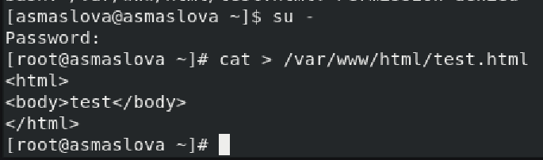{#fig:009 width=70%}

10. С помощью команды `ls -lZ /var/www/html/test.html` я проверила контекст созданного мною файла (рис. [@fig:010]). 

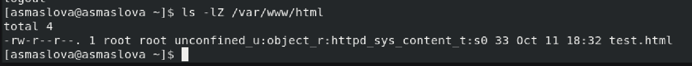{#fig:010 width=70%}

11. Введя в браузере адрес http://127.0.0.1/test.html, я обратилась к файлу через веб-сервер. Он был успешно отображен (рис. [@fig:011]).

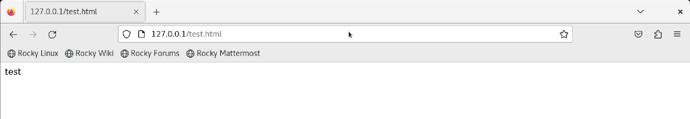{#fig:011 width=70%}

12. Я попыталась изучить справку `man httpd_selinux` и выяснить, какие контексты файлов определены для httpd, но у меня отсутствует эта справка по неизвестным причинам, поэтомуя просто решила еще раз проверить контекст файла командой `ls -Z /var/www/html/test.html` (рис. [@fig:012]).

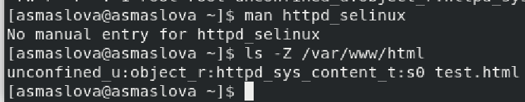{#fig:012 width=70%}

13. После я изменила контекст файла /var/www/html/test.html с httpd_sys_content_t на samba_share_t с помощью команд:
```bash
chcon -t samba_share_t /var/www/html/test.html
ls -Z /var/www/html/test.html
```

После этого я проверила, что контекст поменялся (рис. [@fig:013]).

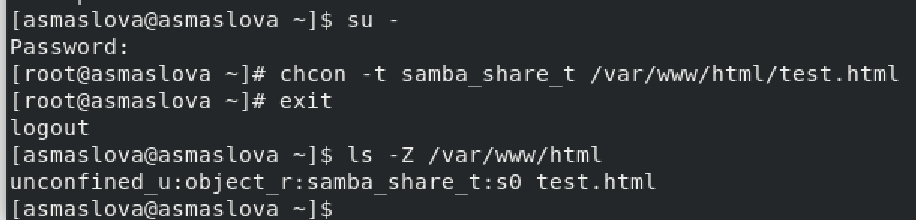{#fig:013 width=70%}

14. Введя в браузере адрес http://127.0.0.1/test.html,  я ещё раз попробовала получить доступ к файлу через веб-сервер и получила сообщение об ошибке (рис. [@fig:014]):
```
Forbidden
You don't have permission to access /test.html on this server.
```

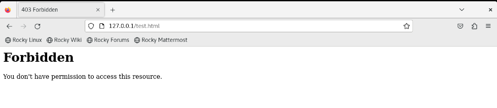{#fig:014 width=70%}

15. Я просмотрела системный лог-файл с помощью команды `tail /var/log/messages`, чтобы понять, почему файл не был отображён, если права доступа позволяют читать этот файл любому пользователю (рис. [@fig:015]). 

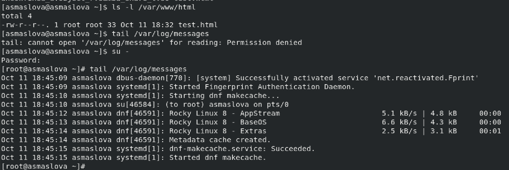{#fig:015 width=70%}

16. Я попробовала запустить веб-сервер Apache на прослушивание ТСР-порта 81 (а не 80, как рекомендует IANA и прописано в /etc/services). Для этого в файле /etc/httpd/httpd.conf я нашла строчку Listen 80 и заменила её на Listen 81.

17. Я выполнила перезапуск веб-сервера Apache, но произошел сбой  (рис. [@fig:016])

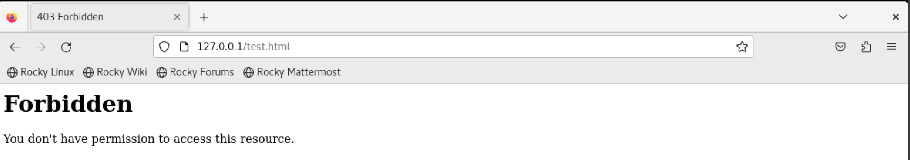{#fig:016 width=70%}

18. Я проанализировала лог-файлы командой `tail -nl /var/log/messages`, просмотрела файлы /var/log/http/error_log, /var/log/http/access_log и /var/log/audit/audit.log (рис. [@fig:017], [@fig:018]).

{#fig:017 width=70%}

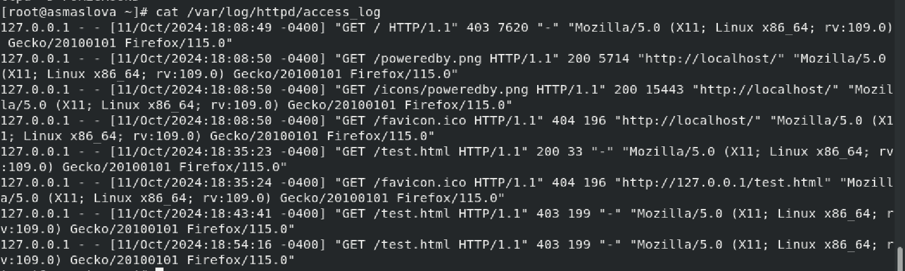{#fig:018 width=70%}

19. Я выполнила команду `semanage port -a -t http_port_t -р tcp 81`, после чего проверила список портов командой `semanage port -l | grep http_port_t` (рис. [@fig:019]).

{#fig:019 width=70%}

20. Я попробовала запустить веб-сервер Apache ещё раз, но он как в прошлый раз не работал, так и сейчас не работает, просто теперь с другим системным сообщением (рис. [@fig:020]).

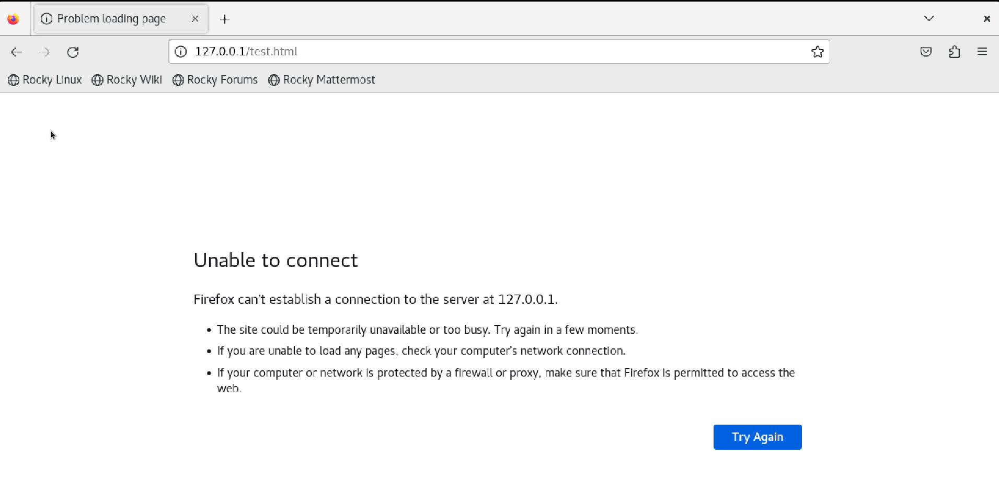{#fig:020 width=70%}

21. Я вернула контекст httpd_sys_cоntent__t к файлу /var/www/html/test.html командой `chcon -t httpd_sys_content_t /var/www/html/test.html` (рис. [@fig:021]). После этого я попробовала получить доступ к файлу через веб-сервер, введя в браузере адрес http://127.0.0.1:81/test.html, и увидела содержимое файла — слово «test» (рис. [@fig:022]).

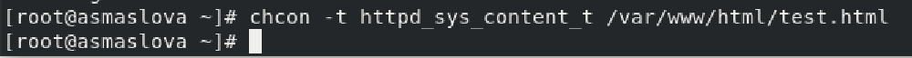{#fig:021 width=70%}

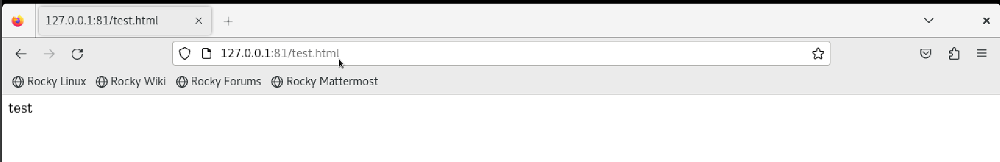{#fig:022 width=70%}

22. Я исправила обратно конфигурационный файл apache, вернув Listen 80 (рис. [@fig:023]).

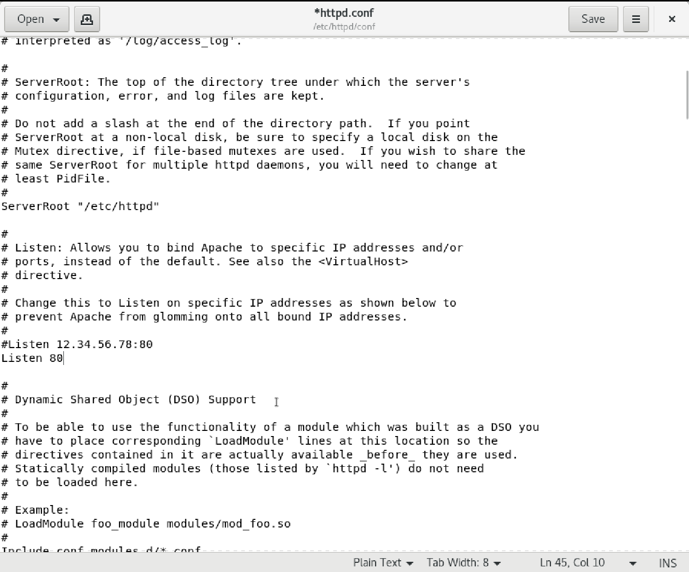{#fig:023 width=70%}

23. Я удалила привязку http_port_t к 81 порту командой `semanage port -d -t http_port_t -p tcp 81` (рис. [@fig:024]).

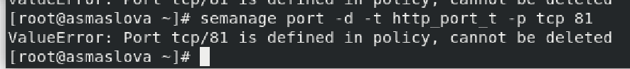{#fig:024 width=70%}

24. В конце я удалила файл /var/www/html/test.html командой `rm /var/www/html/test.html` (рис. [@fig:025]).

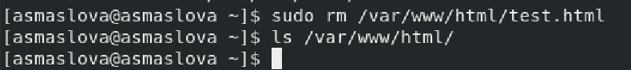{#fig:025 width=70%}

# Вывод

В ходе лабораторной работы я развила навыки администрирования ОС Linux, получила первое практическое знакомство с технологией SELinux1 и проверила работу SELinx на практике совместно с веб-сервером Apache.

# Список литературы{.unnumbered}

::: {#refs}
:::