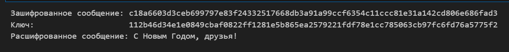

---
## Front matter
lang: ru-RU
title: Лабораторная работа №7
subtitle: "Элементы криптографии. Однократное гаммирование"
author:
  - Маслова А. С.
institute:
  - Российский университет дружбы народов, Москва, Россия
date: 19 октября 2024

## i18n babel
babel-lang: russian
babel-otherlangs: english

## Formatting pdf
toc: false
toc-title: Содержание
slide_level: 2
aspectratio: 169
section-titles: true
theme: metropolis
header-includes:
 - \metroset{progressbar=frametitle,sectionpage=progressbar,numbering=fraction}
 - '\makeatletter'
 - '\beamer@ignorenonframefalse'
 - '\makeatother'
---

# Информация

## Докладчик

:::::::::::::: {.columns align=center}
::: {.column width="70%"}

  * Маслова Анастасия Сергеевна
  * студентка группы НКНбд-01-21
  * Российский университет дружбы народов
  * [1032216455@rudn.ru](mailto:1032216455@rudn.ru)
  * <https://github.com/asmaslova/>

:::
::: {.column width="30%"}


:::
::::::::::::::

# Цель работы

## Цель работы

Освоить на практике применение режима однократного гаммирования.

# Выполнение лабораторной работы

## Выполнение лабораторной работы

```python
import binascii
import secrets

def str_to_hex(s):
    return binascii.hexlify(s.encode('utf-8')).decode('utf-8')

def hex_to_str(h):
     return binascii.unhexlify(h.encode('utf-8')).decode('utf-8')

```

## Выполнение лабораторной работы

```python
def xor_hex_str(hex1, hex2):
    bytes1 = bytes.fromhex(hex1)
    bytes2 = bytes.fromhex(hex2)
    xor_result = bytes(a ^ b for a, b in zip(bytes1, bytes2))
    return xor_result.hex()

def gen_random_key(l):
    random_bytes = secrets.token_bytes(l)
    return random_bytes
```

## Выполнение лабораторной работы

```python
def encrypt_message(message):
    message_bytes = message.encode('utf-8')
    key = gen_random_key(len(message_bytes))
    cipher_bytes = bytes(a^b for a,b in zip(message_bytes, key))
    return cipher_bytes, key

def decrypt_message(cipher_bytes, key):
    decrypted_bytes = bytes(a^b for a,b in zip(cipher_bytes, key))
    return decrypted_bytes.decode('utf-8')
```
## Выполнение лабораторной работы

```python
open_message = "С Новым Годом, друзья!"
encrypted_message, key = encrypt_message(open_message)
print("Зашифрованное сообщение:", encrypted_message.hex())
print("Ключ:                   ", key.hex())
decrypted_message = decrypt_message(encrypted_message, key)
print("Расшифрованное сообщение:", decrypted_message)
```

## Выполнение лабораторной работы

{#fig:001 width=70%}

# Вывод

## Вывод

В ходе лабораторной работы я освоила на практике применение режима однократного гаммирования.