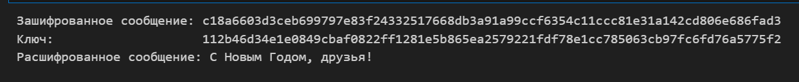

---
## Front matter
title: "Лабораторная работа №7"
subtitle: "Элементы криптографии. Однократное гаммирование"
author: "Маслова Анастасия Сергеевна"

## Generic otions
lang: ru-RU
toc-title: "Содержание"

## Bibliography
bibliography: bib/cite.bib
csl: pandoc/csl/gost-r-7-0-5-2008-numeric.csl

## Pdf output format
toc: true # Table of contents
toc-depth: 2
lof: true # List of figures
lot: true # List of tables
fontsize: 12pt
linestretch: 1.5
papersize: a4
documentclass: scrreprt
## I18n polyglossia
polyglossia-lang:
  name: russian
  options:
    - spelling=modern
    - babelshorthands=true
polyglossia-otherlangs:
  name: english
## I18n babel
babel-lang: russian
babel-otherlangs: english
## Fonts
mainfont: PT Serif
romanfont: PT Serif
sansfont: PT Sans
monofont: PT Mono
mainfontoptions: Ligatures=TeX
romanfontoptions: Ligatures=TeX
sansfontoptions: Ligatures=TeX,Scale=MatchLowercase
monofontoptions: Scale=MatchLowercase,Scale=0.9
## Biblatex
biblatex: true
biblio-style: "gost-numeric"
biblatexoptions:
  - parentracker=true
  - backend=biber
  - hyperref=auto
  - language=auto
  - autolang=other*
  - citestyle=gost-numeric
## Pandoc-crossref LaTeX customization
figureTitle: "Рис."
tableTitle: "Таблица"
listingTitle: "Листинг"
lofTitle: "Список иллюстраций"
lotTitle: "Список таблиц"
lolTitle: "Листинги"
## Misc options
indent: true
header-includes:
  - \usepackage{indentfirst}
  - \usepackage{float} # keep figures where there are in the text
  - \floatplacement{figure}{H} # keep figures where there are in the text
---

# Цель работы

Освоить на практике применение режима однократного гаммирования.

# Теоретические сведения

Гаммирование представляет собой наложение (снятие) на открытые (зашифрованные) данные последовательности элементов других данных, полученной с помощью некоторого криптографического алгоритма, для получения зашифрованных (открытых) данных. Иными словами, наложение гаммы — это сложение её элементов с элементами открытого (закрытого) текста по некоторому фиксированному модулю, значение которого представляет собой известную часть алгоритма шифрования.
В соответствии с теорией криптоанализа, если в методе шифрования используется однократная вероятностная гамма (однократное гаммирование) той же длины, что и подлежащий сокрытию текст, то текст нельзя раскрыть. Даже при раскрытии части последовательности гаммы нельзя получить информацию о всём скрываемом тексте.

# Порядок выполнения работы

Нужно подобрать ключ, чтобы получить сообщение «С Новым Годом, друзья!». Требуется разработать приложение, позволяющее шифровать и дешифровать данные в режиме однократного гаммирования. Приложение должно:
1. Определить вид шифротекста при известном ключе и известном открытом тексте.
2. Определить ключ, с помощью которого шифротекст может быть преобразован в некоторый фрагмент текста, представляющий собой один из
возможных вариантов прочтения открытого текста.

#  Выполнение работы

Для выполнения работы я использовала язык программирования python, библиотеки `binascii`, `secrets`. Работа кода построена следующим образом:

- Сначала сообщение преобразуется в шестнадцатиричный вид, чтобы было проще оперировать битами.
- Далее сообщение кодируется с помощью случайно сгенерированного ключа.
- С помощью функции decrypt_message сообщение может быть раскодировано обратно.

Весь код представлен ниже.

```python
import binascii
import secrets

def str_to_hex(s):
    return binascii.hexlify(s.encode('utf-8')).decode('utf-8')

def hex_to_str(h):
     return binascii.unhexlify(h.encode('utf-8')).decode('utf-8')

def xor_hex_str(hex1, hex2):
    bytes1 = bytes.fromhex(hex1)
    bytes2 = bytes.fromhex(hex2)
    xor_result = bytes(a ^ b for a, b in zip(bytes1, bytes2))
    return xor_result.hex()

def gen_random_key(l):
    random_bytes = secrets.token_bytes(l)
    return random_bytes

def encrypt_message(message):
    message_bytes = message.encode('utf-8')
    key = gen_random_key(len(message_bytes))
    cipher_bytes = bytes(a^b for a,b in zip(message_bytes, key))
    return cipher_bytes, key

def decrypt_message(cipher_bytes, key):
    decrypted_bytes = bytes(a^b for a,b in zip(cipher_bytes, key))
    return decrypted_bytes.decode('utf-8')

open_message = "С Новым Годом, друзья!"
encrypted_message, key = encrypt_message(open_message)
print("Зашифрованное сообщение:", encrypted_message.hex())
print("Ключ:                   ", key.hex())
decrypted_message = decrypt_message(encrypted_message, key)
print("Расшифрованное сообщение:", decrypted_message)
```

Так выглядит вывод моей программы (рис. [@fig:001]).

{#fig:001 width=100%}

# Выводы

В ходе лабораторной работы я освоила на практике применение режима однократного гаммирования.

# Список литературы{.unnumbered}

::: {#refs}
:::