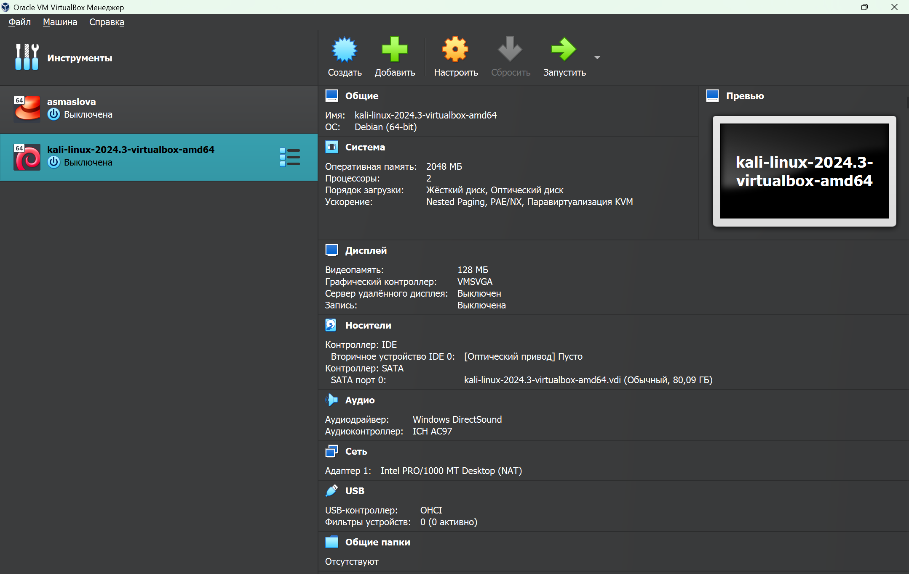

---
## Front matter
lang: ru-RU
title: Этап №1 индивидуального проекта
subtitle: "Установка дистрибутива Kali Linux в виртуальную машину"
author:
  - Маслова А. С.
institute:
  - Российский университет дружбы народов, Москва, Россия
date: 14 сентября 2024

## i18n babel
babel-lang: russian
babel-otherlangs: english

## Formatting pdf
toc: false
toc-title: Содержание
slide_level: 2
aspectratio: 169
section-titles: true
theme: metropolis
header-includes:
 - \metroset{progressbar=frametitle,sectionpage=progressbar,numbering=fraction}
 - '\makeatletter'
 - '\beamer@ignorenonframefalse'
 - '\makeatother'
---

# Информация

## Докладчик

:::::::::::::: {.columns align=center}
::: {.column width="70%"}

  * Маслова Анастасия Сергеевна
  * студентка группы НКНбд-01-21
  * Российский университет дружбы народов
  * [1032216455@rudn.ru](mailto:1032216455@rudn.ru)
  * <https://github.com/asmaslova/>

:::
::: {.column width="30%"}

:::
::::::::::::::

# Цель работы

## Цель работы

Установка дистрибутива Kali Linux в виртуальную машину.

# Выполнение лабораторной работы

## Выполнение лабораторной работы

Для выполнения данного этапа я скачала готовый образ Kali Linux для VM VirtualBox. Все, что от меня требовалось - добавить его в список машин в приложении (рис. [@fig:001]). Затем я сменила пароль для root на toor1234567.

## Выполнение лабораторной работы

{#fig:001 width=70%}

# Выводы

## Выводы

В ходе лабораторной работы я установила дистрибутив Kali Linux в виртуальную машину.
