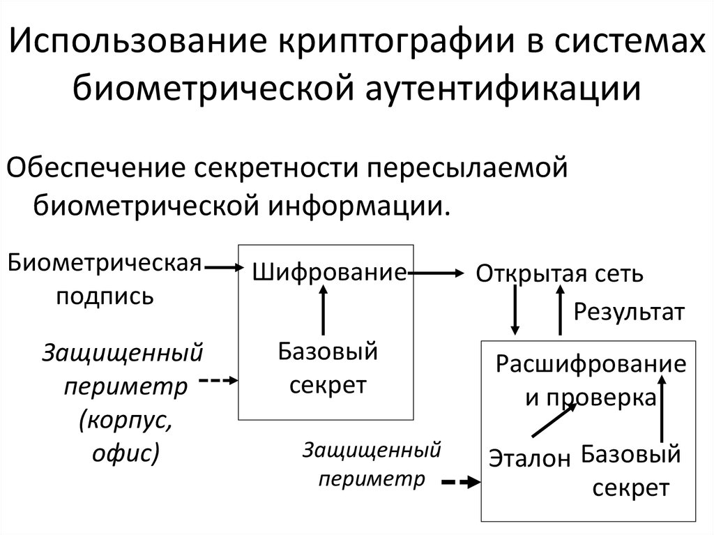

---
## Front matter
lang: ru-RU
title: Биометрия
subtitle: 
author:
  - Маслова А. С.
institute:
  - Российский университет дружбы народов, Москва, Россия
date: 17 октября 2024

## i18n babel
babel-lang: russian
babel-otherlangs: english

## Formatting pdf
toc: false
toc-title: Содержание
slide_level: 2
aspectratio: 169
section-titles: true
theme: metropolis
header-includes:
 - \metroset{progressbar=frametitle,sectionpage=progressbar,numbering=fraction}
 - '\makeatletter'
 - '\beamer@ignorenonframefalse'
 - '\makeatother'
---

## Докладчик

:::::::::::::: {.columns align=center}
::: {.column width="70%"}

  * Маслова Анастасия Сергеевна
  * студентка группы НКНбд-01-21
  * Российский университет дружбы народов
  * [1032216455@rudn.ru](mailto:1032216455@rudn.ru)
  * <https://github.com/asmaslova/>

:::
::: {.column width="30%"}

:::
::::::::::::::

## История биометрии

:::::::::::::: {.columns align=center}
::: {.column width="50%"}

{width=100%}

:::
::: {.column width="50%"}

{width=100%}

:::
::::::::::::::

## Интеграция биометрии и криптографии
{width=100%}

## Biometric Encryption (BE)
Основные компоненты Biometric Encryption:

  - Шаблоны биометрии
  - Генерация и восстановление ключей
  - Связывание биометрии с секретом
  - Проверка идентичности

## Виды биометрических криптографических систем

:::::::::::::: {.columns align=center}
::: {.column width="50%"}

{width=70%}

:::
::: {.column width="50%"}

  - Системы с освобождением ключа

  - Системы со связыванием ключа

  - Системы с генерацией ключа

:::
::::::::::::::  

## Преимущества биометрии в криптографии
{width=100%}

## Спуфинг и защита от него
{width=100%}

# Заключение
